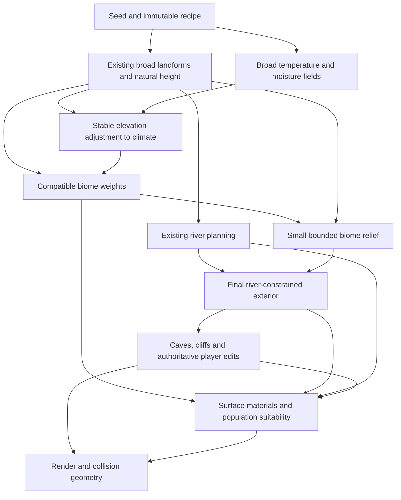
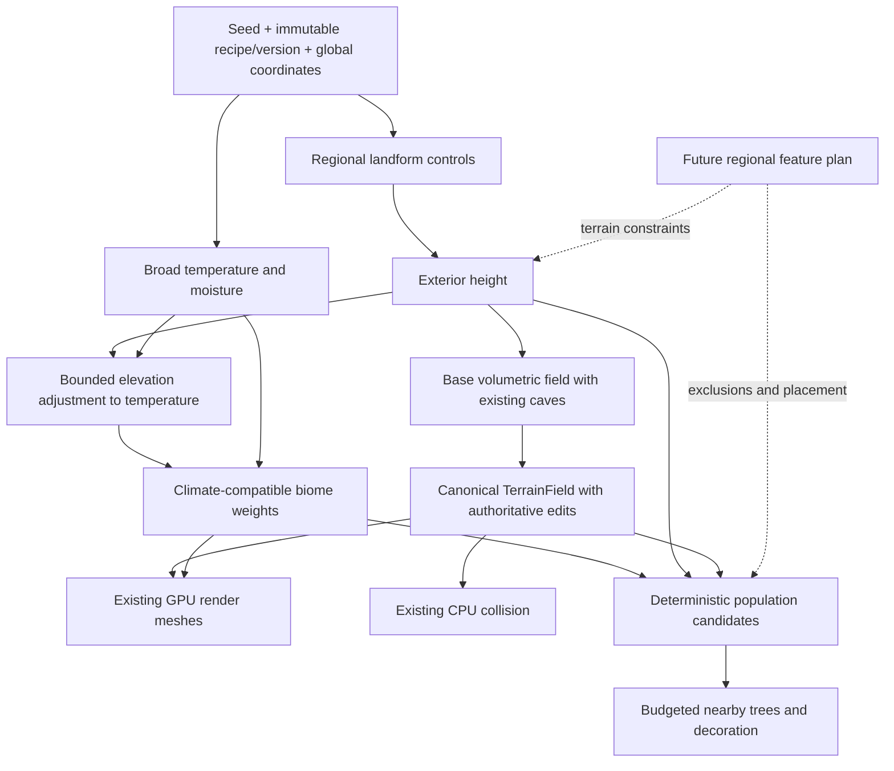

# Biome terrain generation: research and proposed architecture

## September 20, 2026: biome research and recommended next slice

Status: research and recommendation only. No biome runtime changes or performance
claims. This review supersedes the older four-environment/temperate-only scope
below. The user wants about eight initial environments, climate-compatible
transitions, preservation of the current terrain's character, and small
biome-specific height changes. Implementation is deferred pending this research.

### Direct answer: what comes first?

Predefine the **biome recipes**, but derive their **locations** from continuous
environmental fields. Keep the current terrain as the broad foundation. Evaluate
temperature and moisture alongside it, use stable broad elevation to adjust
climate, then select compatible biome weights. Apply modest local terrain
refinements and finally resolve surface cover and population.

This is a hybrid: neither eight independently generated terrain patches nor a
finished heightmap painted with altitude bands. A desert can have hills; a
forest can climb mountains; snow can occur on low ground in a cold region.
Height constrains a biome but does not uniquely determine it.

"First" describes dependencies for a requested coordinate or bounded region.
It does not require allocating or completing a world-sized heightmap. Seed,
version and coordinates determine the same result before or after chunks load.

### Evidence from games, engine source and research

These are well-documented reference implementations, not a measured ranking.
Sources were inspected on September 20, 2026. Developer release notes establish
behavior; source code establishes the scoped algorithm; research prototypes do
not establish shipped-game performance. Historical release claims are dated.

| Reference | Verified evidence | Implication for Voxels3 and limits |
| --- | --- | --- |
| [Minecraft Java 1.18 release notes](https://feedback.minecraft.net/hc/en-us/articles/4415128577293-Minecraft-Java-Edition-1-18), World Generation | Terrain shape varies independently of biome identity; forests and deserts can occur on hills, and redundant shape variants were merged. | Preserve independent landforms and climate. This is evidence about 1.18 behavior, not proof that every generation stage is independent or a complete account of today's internals. |
| [Mojang's 2021 experimental generation notes](https://www.minecraft.net/en-us/article/new-world-generation-java-available-testing), snapshots 3-6 | Developers repeatedly adjusted incompatible temperatures, tiny biome fragments and mountain-biome placement; cold regions begin snowy slopes lower than warm regions. | Climate adjacency and fragment size need deliberate rules and inspection. Smooth noise alone is not a documented guarantee. Do not blindly retain the current climate-independent snow caps. |
| [Factorio FFF-390](https://www.factorio.com/blog/post/fff-390), Noise tools; [FFF-401](https://www.factorio.com/blog/post/fff-401), Investigating missing decoratives | Continuous fields can be visualized directly. Nauvis decorative distribution uses moisture, temperature and terrain-type context plus smaller patch variation; competing placement ranges had suppressed content. | Inspect continuous fields and final populations separately. A defined jungle is useless if priority rules prevent it appearing. These are 2D tile/decorative systems, not SDF cost measurements. |
| [Luanti biome API](https://api.luanti.org/definition-tables/#biome-definition) and [mg_biome.cpp](https://github.com/luanti-org/luanti/blob/master/src/mapgen/mg_biome.cpp), `getBiomes`, `calcBiomeFromNoise` | Heat/humidity noises and height feed biome selection. Eligible entries compete by squared heat/humidity distance divided by biome weight, with positional restrictions and vertical blending. | Concrete, inspectable climate-space classification. Climate-space Voronoi cells are not geographic Voronoi territories. Nearest-center lookup alone does not enforce our forbidden transitions. Source is a moving master snapshot, not a pinned release. |
| [Vintage Story spawn-condition source](https://github.com/anegostudios/vsapi/blob/master/Common/Entity/SpawnConditions.cs), `MatchesClimate`, `MatchesForestation`; [worldgen climate API](https://apidocs.vintagestory.at/json-docs/jsondocs/Vintagestory.API.Common.EnumGetClimateMode.html) | Content eligibility checks temperature/rainfall and forest/shrub conditions. The API distinguishes generated climate values, loosely annual averages, from current-date conditions. | Give content habitat requirements and keep persistent climate separate from future weather. This source does not by itself establish the entire terrain-generation order or every plant implementation. |
| [Guerrilla's Horizon Zero Dawn presentation](https://www.guerrilla-games.com/read/gpu-based-procedural-placement-in-horizon-zero-dawn), GDC 2017, PDF pp. 2-10 | Deterministic, locally stable, density-based runtime placement uses ecotopes to drive assets, distributions, color, weather, effects, sound and wildlife. Streamed 2D world data is generated and paintable; placement data is extensively hand-painted. | A biome is an environment recipe with local variation, not just a color. Borrow bounded realization and coherent content; its authored world maps do not solve our procedural climate placement. |
| [Iron Gate's Valheim FAQ](https://www.valheimgame.com/faq/), Gameplay questions | Biomes provide different challenges, resources, enemies and secrets; progression is tied to biome content. | Exploration needs reasons to visit and revisit regions. The FAQ is design evidence, not an algorithm: no radial biome-placement formula or terrain-first ordering is inferred from it. |
| [Hello Games' Continuous World Generation in No Man's Sky](https://www.gdcvault.com/play/1024265/), GDC 2017 overview | Describes a pipeline from voxel terrain through polygonization and texturing to population and simulation. | Separate terrain readiness from population. Only the public overview was verified here; it does not establish within-planet climate adjacency or exact biome selection. |
| [AutoBiomes, Fischer et al., 2020](https://cgvr.cs.uni-bremen.de/papers/cgi20/AutoBiomes.pdf), sections 3-4, [DOI](https://doi.org/10.1007/s00371-020-01920-7) | Explicit sequence: rough terrain, simplified climate, biome-based terrain refinement, asset placement. Refinement combines procedural terrain and elevation examples. | Direct support for a staged hybrid, not a reason to import its DEM database or climate simulation. Its finite-grid authoring measurements are not a frame-budget result for streamed SDF terrain. |
| [ProcWorld: Geometry Is Destiny Part 2](https://procworld.blogspot.com/2016/07/geometry-is-destiny-part-2.html), 2016 | Temperature uses map controls and elevation. Mesh-based water transport/precipitation drives moisture; climate is mapped to biome types. | Terrain-aware climate can explain wet/dry geography. Its map-domain simulation and boundaries need a separate streaming design; it is not a cheap independent chunk query. |
| [Red Blob Games: terrain from noise](https://www.redblobgames.com/maps/terrain-from-noise/), Biomes | Demonstrates elevation plus independent moisture, and discusses temperature and richer environmental inputs. | Good transparent baseline, not a shipped-game ranking. Copying its altitude bands would couple snow to peaks and waste our existing landform variety. |

Horizon slide 9 explicitly maps the same placement field to different density
curves for forest-edge and forest-interior trees. This is a useful concrete
pattern for readable transitions. AutoBiomes p. 3, figure 1 shows the four-stage
dependency order; its different-resolution grids also separate climate from
terrain detail. Section 4 reports authoring-scale work in seconds, not a streamed
frame-time guarantee. Both diagrams were rendered and visually inspected.

The Horizon and AutoBiomes PDFs were downloaded and their text inspected because
web PDF opening failed. Temporary copies live outside the committed report in
`.codex/biome-research/`. No unseen Minecraft video content or community
reverse engineering is used to substantiate exact backend claims.

### Comparing the approaches

| Approach | What it buys | Main cost or failure mode | Decision |
| --- | --- | --- | --- |
| Select geographic biome territories, then generate their terrain | Strong authored identity, controlled destinations and progression | Needs neighbor-aware blending and shared geographic constraints; can make every desert or mountain region repeat its recipe | Reserve for future authored destinations if needed; do not replace the current generator with it |
| Finish terrain, classify by height/slope | Simple; faithfully preserves terrain | Height alone cannot distinguish equally high wet forest and dry desert; snow becomes an altitude stripe | Use terrain as an input, never as the only classifier |
| Shared terrain/climate fields, then bounded biome refinement | Preserves varied landforms, coherent climate, local identity and on-demand evaluation | Needs explicit stage order, eligibility coverage and conservative bounds | Recommended |
| Simulate geography, wind, rainfall and erosion, then classify | Strong causal geography, rain shadows and drainage relationships | Nonlocal dependencies, boundary conditions, iteration and tuning costs | Later bounded regional feature, only if the extra geography matters |
| Artist-painted biome and population maps | Direct composition and reliable landmarks | Authoring effort and finite-map dependencies | Learn from Horizon's content controls; procedural fields remain our default |

Geographic Voronoi plus blending is not inherently wrong or inevitably seamed.
It solves a different problem: explicit territories. Climate-space nearest-biome
selection likewise is not inherently bad; for eight biomes, explicit compatible
ranges make missing coverage and forbidden combinations easier to audit.

### Recommended dependency order



This is the proposed dependency graph, not a statement that these new stages
exist. Preserve the current natural-height function as the climate/drainage
reference. Add small biome relief downstream of river planning and upstream of
the final river constraint. Fade refinement out around river corridors and
shorelines using existing bounded feature descriptors. Do not change drainage
node heights in this first slice. Confirm the existing valley evaluator can
consume the refined exterior while retaining the same river footprint; otherwise
redesign that precise boundary before implementation.

Regional rainfall must not depend on final river geometry if river geometry
depends on climate/refinement. Keep broad moisture independent; river proximity
can enrich **local habitat wetness** downstream, allowing a green corridor
through a desert without reclassifying the entire region as jungle. Existing
ocean identity and inland river water must remain distinct even when both share
the current fixed water level. A below-water sample alone is not an ocean test.

The climate reference must be continuous and sufficiently broad. Use an existing
bounded broad-elevation contribution if possible. Raw steep mountain detail
cannot silently override the minimum desert/snow separation. No player edit,
tree placement, clock or load order feeds back into regional biome selection.

### Climate, classification and transitions

Use separate seeded continuous fields for temperature and moisture. In this slice
they are normalized art controls: moisture means long-term habitat wetness, not
instantaneous relative humidity. Precipitation, evapotranspiration and soil water
are distinct physical quantities; two noise fields approximate the desired
patterns rather than simulating them.

Prefer broad irregular climate regions over strict repeating latitude bands for
this exploration-focused flat world. Latitude is useful when compass direction
should predict a journey to colder climates, but that is a gameplay decision,
not a requirement for plausible biomes. Avoid adding a latitude mode and a
regional mode before that choice is needed. Defer rain shadows and seasons.

Biome definitions supply eligibility and continuous weights. Normalize only
eligible weights, with complete climate-domain coverage. A dominant label is
useful for display and diagnostics; terrain refinement and appearance should
consume weights, not abruptly switch on that label. Smooth material boundaries
alone cannot fix discontinuous geometry or incompatible tree placement.

The key rule is **hot desert and persistent snow have disjoint temperature
supports with an intermediate band**. Dry climates need not be hot, and snow
does not define every cold habitat, but the first palette can group those
variants without adding more named biomes. Warm/dry grassland and cool woodland
can serve as transition variants of existing recipes.

Smooth noise is insufficient to guarantee a useful distance between extremes.
If the supports have a temperature gap `deltaT`, and the complete temperature
field has spatial gradient bound `G`, separation is at least `deltaT/G`.
Elevation, coordinate warping and every small-scale term contribute to `G`.
Cap or broaden those terms and include the material filter's world-space support
when selecting a buffer. With `G=0`, both supports cannot occur in one continuous
domain. A numerical survey can expose failures but cannot replace this bound.

Use the same eligibility for snow materials, desert sand, trees and displayed
identity. Otherwise the label can pass while the player sees snow meeting sand.
The current mountain-peak snow rule must be reconciled with climate rather than
left as an unconditional override. Require an intermediate rocky/cool belt for
high-altitude snow near warm terrain too; do not invent an exception to the
user's separation requirement.

Region size, blend width and local patch size are three different controls.
Broad climate establishes destinations, transitions connect them, and compatible
small variations create clearings, rocky exposures and forest edges. Noise
wavelength does not guarantee minimum biome area or proximity to spawn. Observe
connected fragments and travel distance across fixed seeds, then decide whether
explicit bounded region planning is justified. Do not add it speculatively.

### Eight initial environments without eight terrain generators

Retain the requested player-facing palette, with forest as the eighth proposal.
Internally distinguish landform from habitat so labels do not erase combinations.

| Environment | Eligibility/identity | Local character and modest relief direction |
| --- | --- | --- |
| Ocean | Existing marine basin/sea context | Seabed, shore transitions; preserve basin and shoreline layout |
| Plains | Open non-extreme habitat on plain-dominant terrain | Open grassland, dry/cool variants, very shallow undulation |
| Hills | Open non-extreme habitat on hill-dominant terrain | Rolling grass/scrub, exposed stone, retain current hill structure |
| Mountains | Rocky/exposed mountain-dominant terrain | Current massifs and saddles, sparse suitable vegetation; climate controls snow |
| Desert | Hot and dry, excluding marine floor | Sand/stone mosaic, sparse cover, shallow dunes only on suitable gentle terrain |
| Snow | Persistent cold; broad climate and bounded elevation response | Snow over supported exterior, exposed steep rock, restrained local relief |
| Forest | Suitable non-extreme climate and sufficient moisture | Tree clusters, glades and understory; woodland can cover hills or mountain flanks |
| Jungle | Warm and wet, suitable support/slope | Denser layered vegetation and humid ground cover; no requirement for flat terrain |

An implementation should not use eight unrelated weights in one blind priority
chain. Separate marine eligibility, climatic extremes, vegetation cover and
open-landform naming. Forests and jungles must appear on a meaningful amount of
eligible land; mountain masking must not consume every potential forest site.
Forest and jungle require recognizable vegetation; a grass tint and a new label
are only classification scaffolding, not complete environments. New species,
resources, wildlife and weather are separate content scopes, not promised here.

Proposed starting relief envelope: `abs(deltaHeight) <= 0.02 * ReliefHeight`,
which is 61.44 world units (about 1.56 m) at the source default of 3072. This is a
conservative authoring proposal, not a measured best value or accepted criterion.
Fade it to zero on shorelines, river corridors and steep rock. Dunes should not
flatten mountain massifs. Small amplitude does not guarantee small slopes: bound
the refinement derivative and choose wavelengths relative to the existing
16-unit sample spacing. Visual shader relief cannot substitute for geometry when
the change should affect traversal or collision.

### Current-source integration findings

Inspected working tree: HEAD `0113a5bc89ff750b4c87386c41369ac9e8e5a5d2` plus
pre-existing edits; this is not a clean-commit behavior claim. Native editor
reported voxels3, engine 26.09.15, visible play active. No game mutation or runtime
test was performed for this research.

| Current owner | Observed fact and required integration |
| --- | --- |
| [RegionalLandforms](../../Code/Voxels/Generation/RegionalLandforms.cs), `SampleNatural`, `SampleWorld`, `BoundNaturalHeight` | Current natural relief includes erosion; rivers constrain it afterward. Keep this foundation. New relief requires matching local/global conservative bounds, not just a changed height sample. |
| [ProceduralTerrainSdf](../../Code/Voxels/ProceduralTerrainSdf.cs) | Current generator version is 48. Full field includes cliffs and caves; existing build-local XY reuse remains the place to share column work. A surface-biome query must not turn underground queries into surface material. |
| [RiverDrainageBasin](../../Code/Voxels/Generation/RiverDrainageBasin.cs) | Drainage nodes directly sample natural height. Inserting climate-dependent relief there can change catchments and river routes even with a small offset. |
| [ProceduralVoxelMaterials](../../Code/Voxels/Materials/ProceduralVoxelMaterials.cs), [GPU materials](../../Assets/shaders/voxels/voxel_generated_materials.hlsl) | Snow currently depends on mountain/peak weights; sand has its own layer rules. Extend the canonical rules and their GPU mirror together, preserving buried strata and explicit placed materials. |
| [GPU material binding](../../Code/Voxels/Materials/GpuVoxelMaterials.cs) | Existing material weights are generated with a fixed spatial filter. Climate support must account for that filter; biome blending is not merely changing the draw shader. |
| [SpawnTreePopulation](../../Code/Voxels/Trees/SpawnTreePopulation.cs) | Population is anchored, bounded to 240 m, and rejects mountain weight above 0.35. It is not yet an exploration-wide climate-aware forest system. Reuse its support/lifecycle work, but do not claim eight populated biomes from it as-is. |
| [World identity codec](../../Code/Voxels/TerrainFieldCodec.cs) | Seed, settings and generator version participate in saved/network identity. New biome/refinement recipes require a deliberate new identity, no silent reinterpretation of existing edited worlds. |

Keep climate/biome functions pure and their settings immutable. Derived
render/collision/population work keeps the existing revision and cancellation
rules. Engine resources remain owned by the existing engine-thread consumers.
Do not add a second world-state store or generate a dense world climate atlas.
Measure repeated climate evaluation before adding a shared cache; reuse existing
column work where its lifetime and responsibility already match.

### What would establish that this is good?

The implementation phase must define immutable scenarios in the validation
ledger before its first run. The following are proposed evidence requirements,
not tests executed by this research:

- Preserve terrain: matched-seed height deltas, slope changes, silhouette views,
  shoreline and river-network checks; confirm refinement envelope and bounds.
- Prove climate compatibility: support/gradient calculation plus fixed desert-to-
  snow transects, including mountain slopes and material-filter edges.
- Inspect distribution: maps of base height, temperature, moisture, final biome,
  blend weights and refinement; area by biome, connected fragments, transition
  widths and travel distance. Include fixed multiple seeds and negative axes.
- Verify recognition on foot: forest/jungle structure, desert sparsity, snowy
  ground, readable hills/mountains and transitions. A map screenshot is not enough.
- Verify deterministic agreement: repeated queries, shared boundaries, reloads,
  CPU/GPU field/material parity and host/client identity; include edits in borders.
- Measure whole-world cost: unchanged canonical figure-eight against a comparable
  baseline, including tails, completion/streaming, memory, allocations and
  correctness. Separately observe a fixed dense forest/jungle traversal if the
  canonical route lacks that content; it supplements rather than replaces it.

No external timing is a Voxels3 budget. Set exact biome scale, transition width,
population density and performance acceptance before qualification, preserving
the project's unchanged figure-eight workload and regression rules. Measure
generation cost and the ongoing cost of vegetation separately. Classification
can be cheap while jungle visibility, shadows and collision are expensive.

### Recommended sequence and decisions

1. Add shared climate and biome suitability to the production authoring query
   and existing terrain survey. Freeze the reference-height and river ordering.
2. Integrate surface materials and bounded height refinement with CPU/GPU parity,
   conservative bounds and versioned world identity as one complete terrain slice.
3. Make population consume the same habitat fields and edited support checks;
   establish visible differences with a deliberately small suitable asset palette.
4. Validate scale and exploration in the playable world, then qualify performance.

Adopt shared environmental fields, compatible smooth weights, existing terrain
as the foundation, bounded local relief, and habitat-aware content. Defer full
climate simulation, latitude modes, global pre-generation, generic biome graphs,
tectonics, world-wide ecological simulation and authored progression zoning.
Revisit those only when a concrete exploration goal requires them.

The unresolved tuning choices are climate/transition scale, the exact eligibility
curves, forest/jungle assets and densities, and accepted relief magnitude. The
research supports the architecture, not those unmeasured values. The initial
eight are an environment palette, not a promise that every finite starting area
contains all eight or that increasing biome count alone improves exploration.

## Historical September 8-9 landform research

The remaining sections preserve rationale and existing incoming anchors for the
earlier landform work. Their v5 source snapshot, replace-height instructions,
four-environment scope, climate deferrals and pending feature lists are historical
and must not be treated as current instructions. The September 20 review above
owns the recommended next biome slice. Current code owns implemented behavior.

Date: 2026-09-08. Status: research proposal, not implemented or performance-qualified.
Latest landform review: source `794b14f`, clean working tree at branch creation.
Working branch: `codex/terrain-biome-generation`. Earlier research began at
`d7c5da6`; current source and the revised scope below supersede that snapshot.

## Recommendation and scope

Build one deterministic, bounded terrain recipe that separates **landform**
(ocean basins, plains, hills, mountains) from **biome/vegetation cover**. The
immediate first slice is now **regional landforms only**: replace the existing
exterior generator, retain the current cave recipe, and expose a small set of
meaningful global controls. The [landform implementation plan](../Plans/RegionalLandformsFirstSlice.md)
owns the selected first-slice scope, proposed defaults, execution steps and gates.
This research owns the reasoning and the later biome architecture.

Temperature and moisture remain the proposed shared inputs for the later biome
slice, with explicit rules separating hot deserts and snowy biomes. They are
not implemented in the landform slice, and no placeholder climate modules are
required. This sequencing supersedes the earlier combined landform/climate/forest
first slice; the compatibility and deep-module design requirements remain.

Prioritize frame pacing over generation throughput: admit less work when busy,
retain valid terrain coverage, and let distant detail and vegetation arrive
progressively. This preference does not permit missing collision beneath players,
unbounded queues, or permanent starvation.

The first demonstration must read well as bare terrain: broad plains, rolling
hills, connected-looking mountain ridges, foothills, shelves and low ocean basins.
Ocean means terrain relative to a reference level here, not rendered water.
The later biome demonstration adds forest/grassland and a small vegetation palette;
a forest must contain trees rather than only a label or tint.

Defer climate implementation, vegetation, biome materials, water rendering,
rivers, lakes, waterfalls, roads, buildings, cities, weather, ecology
simulation, erosion simulation, and a general procedural graph editor. Preserve
the ordering and ownership boundaries those features will need; do not implement
empty framework layers for them.

"Scrap previous generation except caves" replaces the old surface formula and
its frequency/amplitude controls during implementation. It does not discard the
field/edit store, renderer, collision, streaming, saved data or deterministic
noise/hash primitives needed by retained caves. The cave overhaul is a separate
future slice. This task creates research and a plan; it does not change runtime code.

## 1. Current project constraints

Source, rather than older architectural summaries, establishes this starting point:

| Owner | Observed behavior | Consequence for this slice |
| --- | --- | --- |
| [ProceduralTerrainSdf.cs](../../Code/Voxels/ProceduralTerrainSdf.cs), `ProceduralTerrainSettings`, `SampleSurfaceHeight`, `SampleWorld` | Generator v5 uses seed plus base height, frequency and amplitude. Exterior density is Z minus a 2D simplex height; surface-relative noodle/cheese caves produce a volumetric field. | Replace the exterior recipe within the canonical field; preserve the cave responsibility and sign convention. |
| Same file, `LatticeSampler` | CPU sampling already reuses height per XY column in a build-local workspace. | Extend this existing reuse when adding regional controls; do not propose another height cache as if none existed. |
| [GPU meshing](../Architecture/GpuVoxelMeshing.md#regular-extraction-and-render-lifecycle), [GPU field mirror](../../Assets/shaders/voxels/voxel_sdf_v13.hlsl) | GPU extraction samples the field into a haloed lattice. Persistent meshes are drawn without evaluating the SDF each frame. | Additional noise costs generation, while vegetation, material shading and larger meshes can cost every frame. CPU density uploads would conflict with the current GPU rendering contract. |
| [TerrainField.cs](../../Code/Voxels/TerrainField.cs), [deformation contract](../Architecture/TerrainDeformation.md) | Canonical terrain composes the procedural base and immutable regional edit state. | Biomes cannot create independently mutable terrain arrays or bypass the edit boundary. |
| [TerrainFieldCodec.cs](../../Code/Voxels/TerrainFieldCodec.cs), [storage handoff](../Architecture/ChunkAuthoritativeStorage.md) | Saved data includes procedural settings; regional storage and replication already exist, with remaining qualification limits. | New settings/version identity must reach persistence and multiplayer together. Do not implement another save or transport system. |
| [Voxel foundation](../Architecture/VoxelChunkFoundation.md#spatial-contract) | 32 cells per chunk, 16 world units per cell, 512-unit chunks; shared samples and negative-coordinate floor rules. | Express scales in these units; keep boundaries independent of chunk load order. |
| `SampleGlobal` in the generator | Integer sample coordinates become float `Vector3` world positions before noise evaluation. | Current coordinates do not establish arbitrary-distance precision. Infinite streaming and infinite numerical range are different problems. |

The existing preparation, collision and GPU schedulers already have bounded work,
revision checks and lifecycle ownership. Extend their admission and telemetry only
where the new work requires it. Do not build a competing scheduler.

Current warm preparation uses batches of 256 with serialized worker ownership,
and its main-thread integration already has a 0.5 ms budget in
[VoxelManager.cs](../../Code/Voxels/VoxelManager.cs). New population work must fit
the total frame budget, not assume that an additional 0.5 ms is automatically free.

Older foundation/deformation overview text understates subsequent storage and
multiplayer implementation. Consult the latest storage handoff and ledger;
neither those features nor all historical performance gates are newly certified
by this research.

## 2. Evidence from shipped games and established research

These are strong reference cases, not a measured ranking of all terrain systems.
The transferable lessons below are our design judgments. No external timing is
treated as an s&box performance prediction.

| Reference and verified evidence | Adopt for Voxels3 | Transfer limit |
| --- | --- | --- |
| Mojang's [Minecraft Java 1.18 release notes](https://feedback.minecraft.net/hc/en-us/articles/4415128577293-Minecraft-Java-Edition-1-18) explicitly separate terrain shape/elevation from biome identity, allowing forests on hills. | Separate landform from cover; let a few continuous controls produce combinations. | Release notes establish behavior, not exact noise dimensions, spline implementation, thread scheduling or voxel-SDF parity. Do not claim to reproduce Minecraft's generator. |
| Wube's [Factorio noise expressions](https://www.factorio.com/blog/post/fff-390) describes coordinate-based evaluation without depending on what is already placed. [Better noise](https://www.factorio.com/blog/post/fff-112) describes reusing intermediate work across a chunk. | Pure coordinate queries, explicit random channels, and build-local reuse of repeated XY work. | Factorio is primarily a 2D tile world. Its expression language and compiler are unnecessary for four environments, and its optimization results do not predict volumetric costs. |
| Hello Games' [Continuous World Generation in No Man's Sky](https://www.gdcvault.com/play/1024265/Continuous_World_Generation_in__No_Man_s_Sky_) describes a continuous pipeline from voxel generation through polygonization, texturing, population and simulation. | Treat population and simulation as stages with readiness separate from terrain generation. | Only the public session overview was available for this review. Exact job graphs, concurrency, memory budgets and present-day implementation were not established. |
| Guerrilla's [GPU-Based Procedural Placement in Horizon Zero Dawn](https://www.guerrilla-games.com/read/gpu-based-procedural-placement-in-horizon-zero-dawn) describes rule-controlled runtime environment placement around the player. | Deterministic placement rules and bounded nearby realization; keep decorative detail separate from terrain density. | The talk page was inspected; its linked PDF failed to open. No undocumented placement algorithm is attributed to Guerrilla. Its GPU system and artist-authored world do not establish s&box support or an infinite terrain generator. |
| Génevaux et al., [Terrain Generation Using Procedural Models Based on Hydrology](https://perso.liris.cnrs.fr/egalin/Articles/2013-river-networks.pdf), SIGGRAPH 2013, constructs hierarchical drainage networks before combining terrain and river patches. | Reserve a future regional planning step before final local terrain and population. | The paper operates over an input domain; it does not solve our infinite cross-region drainage, runtime water simulation or frame budget. |

The combined lesson is regional coherence plus local evaluation. More noise
octaves alone do not create good environment composition, and a fast generator
does not guarantee a cheap populated scene.

### Landform-focused review and decisions

The desired Minecraft influence is the experience: long views, broad terrain
regions, striking peaks, usable flat areas and variation encountered while
traveling. It is not a requirement to copy a noise router or density algorithm.
The official [experimental world-generation notes](https://www.minecraft.net/en-us/article/new-world-generation-java-available-testing)
describe tuning mountain height/area, large flat areas, and local variation in
otherwise flat terrain. They also record remaining temperature clashes during
development. Adopt explicit visual criteria and test several scales; neither
Minecraft's popularity nor these notes establishes a guaranteed adjacency rule.

Henrik Kniberg's [terrain-generation overview](https://www.youtube.com/watch?v=CSa5O6knuwI)
is a useful developer walkthrough, with terrain shaping at 13:04, 3D noise at
17:37, caves at 20:10 and biomes at 21:27. Only its published description/chapter
list was accessible during this review; no exact spline tables or backend
implementation are attributed to unseen video content. Our fixed response curves
below are a project proposal, not a claimed copy of Minecraft's internals.

Wube's [Factorio terrain overhaul](https://www.factorio.com/blog/post/fff-401)
describes composing distinct elevation contributions and revising them when the
result obstructed travel. It separates water amount from feature scale and uses
broad variation to create larger contrasting regions. Adopt meaningful controls
and traversal-based review. Its 2D tile/cliff implementation and path rules do
not establish our 3D topology, global connectivity, water behavior or performance.

The original [libnoise complex-terrain tutorial](https://libnoise.sourceforge.net/tutorials/tutorial5.html)
demonstrates a terrain-type control field separate from height, ridged mountain
noise, a flatter profile, and softened selection boundaries. Adopt this separation
and bounded profile blending. Do not import its C++ library, one-module-per-operation
graph, full-world heightmap builder or much larger planetary example. This is
algorithm evidence, not a modern production benchmark.

The earlier single relief field made plains, hills and mountains consecutive
bands of one variable. That is easy to prototype but couples mountain prevalence,
hill distribution and region spacing. It also omitted ocean basins and meaningful
user controls. Replace it with the regional hierarchy in section 4. Retain one
canonical recipe and deep modules; do not maintain competing generator modes.

Our first exterior remains a height function. It can produce dramatic ridges,
valleys and cliffs but cannot independently produce overhangs, floating islands
or stacked surfaces. Existing caves preserve volumetric interiors. Adding a new
3D exterior density recipe merely to match every Minecraft formation would
expand the selected slice and its bounds/meshing costs; defer that deliberately.

## 3. One world recipe, several derived outputs

The following diagram describes the full intended architecture, including later
biome work. Slice 1 implements only landforms, retained cave composition and
their existing downstream field/render/collision integration. The names describe
responsibilities, not committed new classes or APIs.



The recipe identifies the immutable configuration shared by the modules below;
it is not one class implementing all their algorithms. Those modules own explicit
seed channels, landform evaluation, climate, biome selection and conservative
bounds under one field specification. A compact XY query returns height, landform weights, climate values,
biome weights and forest suitability. Density queries need only the landform,
height and cave terms for this slice; avoid evaluating climate when a consumer
only needs density. Slope can be derived from documented, fixed-offset samples of
that height when needed for placement. Avoid calculating it for every density
sample. Cache values only inside bounded jobs initially.

The manager owns recipe lifetime and existing pipeline integration. `TerrainField`
continues to own mutable terrain. A population owner holds only bounded derived
candidate/instance state; generated candidate identity does not depend on engine
object identity. Actual engine scene/resource mutations remain on their supported
threads. No new native API or worker-safe engine capability is assumed here.

Jobs capture recipe identity, world epoch, spatial key and relevant terrain
revision. Their owner cancels obsolete work and rejects late completions. A
recipe replacement invalidates all derivatives; a local edit invalidates only
affected terrain and population dependencies, including necessary halos.

### Deep modules and narrow contracts

Design-review requirement: organize generation into deep modules that hide
substantial implementation behind small, meaningful interfaces. A large script
with separate methods, or partial files sharing all of its private state, does
not satisfy this requirement. Module boundaries follow ownership and reasons to
change, rather than one class per noise operation or one generator per biome.

The following is the overall responsibility map. Slice 1 implements Landforms
and evolves Base terrain field, keeping caves behind a separate internal module
boundary for their later overhaul. Climate/biomes, appearance and population are
later work. Names are design labels; concrete types and signatures will be chosen
from the implementation.

| Module | Small consumer-facing contract | Complexity hidden inside / state owner |
| --- | --- | --- |
| Landforms | Evaluate unedited exterior height/landform weights at XY; conservatively bound height over an area. | Relief controls, ridges, octaves, blending, seed channels and height bounds. Immutable settings; build-local XY reuse belongs to its evaluator, not a global atlas. |
| Climate and biomes | Evaluate climate and normalized biome weights from XY and the landform result; validate configured climate coverage and transition constraints. | Temperature/moisture fields, elevation adjustment, eligibility, normalization and forbidden-neighbor separation. Keep climate and selection together initially because they jointly enforce the transition invariant. Immutable settings and a small biome definition table. |
| Base terrain field | Sample unedited volumetric density; conservatively classify a spatial bound; prepare the immutable GPU description. | Composition of the landform exterior and existing caves, CPU/HLSL agreement, sign conventions and field bounds. Evolve `ProceduralTerrainSdf` into this boundary rather than keeping an old sampler alongside a new one. |
| Surface appearance | Resolve derived terrain appearance from biome weights and surface properties. | Small palette, slope/height blending and edited/cave appearance rules; shader-side evaluation or emitted attributes selected during implementation. Owns visual configuration, never authoritative density or new mutable voxel materials. |
| Population | Request/retire candidates for a bounded area and source revision; return bounded instance descriptors and readiness. | Stable IDs, spacing/neighbor halos, suitability, support checks, cancellation and candidate residency. This owner also manages the bounded realization queue; engine operations occur only on supported threads. |

Existing `TerrainField` remains the separate authoritative mutable-state module.
Its canonical field access and commit/invalidation boundary are reused. Render
meshing, collision, storage and replication stay downstream with their existing
owners; none implements its own biome selection or edits the procedural recipe.

An immutable recipe configuration supplies each module only its relevant settings
plus shared world identity. Its configuration/version validation remains canonical
and includes all field, climate and population dependencies. No module receives
the manager, scene, service locator or a mutable catch-all world context merely to
obtain its inputs. Results are immutable values or bounded owned buffers with an
explicit lifetime, not references into another module's mutable internals.

Dependency direction is explicit:

```text
landforms -> base terrain field -> TerrainField -> render/collision
landform result + coordinates -> climate/biomes -> appearance/population
TerrainField regional reader -> population support checks
```

The arrows describe consumed inputs, not mandatory intermediate arrays or serial
whole-world passes. The generation boundary may call landform evaluation directly
and reuse results in a build-local workspace. Consumers ask for density, surface
semantics or population as needed; a density-only collision query need not pay
for climate, appearance or tree generation. Avoid virtual dispatch per sample,
allocations per query and a universal result that eagerly computes every module.
Use concrete calls and compact values initially; introduce interfaces only where
they provide an actual boundary benefit, not to satisfy a class-count target.

`VoxelManager` owns lifecycle wiring: validate/apply configuration, pass bounded
requests to existing schedulers, and publish or retire completed work. It must not
contain biome eligibility tables, noise recipes, tree-spacing rules, appearance
selection or future road/river algorithms. This slice does not redesign unrelated
manager responsibilities; it prevents the new subsystem from expanding that
coupling. A new coordinator may be justified by actual lifecycle complexity, but
must not become another all-purpose generator.

For each requested region, the owner admits work under its existing budget,
captures immutable inputs, computes with bounded scratch, and integrates results
only if the world epoch, recipe and relevant regional revisions still match.
Modules do not start hidden background tasks or bypass scheduler admission.
Pure evaluation can run on workers with supported data; engine realization
remains at the explicit integration boundary. A cancelled result's owner releases
its scratch and retained input references. Account for buffers and candidate
caps per job and per active interest, not just per module instance.

Keep CPU/HLSL implementations aligned with the same responsibility boundaries:
landform arithmetic and base-field composition have corresponding shader includes
when required, and semantic consumers share one biome rule specification. Do not
introduce biome arithmetic into the mesher itself. A general cross-language code
generator is not required by this proposal; manually mirrored rules remain an
explicit parity and versioning obligation.

New biomes should normally add definition/palette/population data inside these
owners. A genuinely new landform algorithm changes Landforms; a new cave algorithm
changes the base-field implementation; neither requires editing the manager or
collision/streaming code. Future regional feature planning gets its own module
only when implemented, supplying immutable bounded constraints to these existing
inputs. No empty planner interface or plugin registry is needed now.

Before accepting implementation, review that each module hides its algorithm,
owns its state/lifetime and exposes only the operations its real consumers need.
Reject cycles, duplicated samplers, shared mutable configuration, one-line wrapper
layers, per-biome subclasses with duplicated pipelines, and a manager that reaches
into module internals. Splitting files alone is not architectural separation.

## 4. Regional landforms and later biome recipe

### When biome selection happens

There is no runtime biome system implemented by this research. In the proposed
pipeline, regional climate and landform controls are evaluated first; exterior
height then permits an elevation adjustment to temperature; biome weights are
selected from those inputs before materials and vegetation are generated.
Density and biome selection share their inputs but have separate outputs.
The first slice does not use a selected biome label to determine terrain height.

"Height first" means the landform height calculation precedes height-dependent
biome selection. It does not mean allocating a full heightmap or finishing the
world before choosing biomes. Broad climate fields can be evaluated independently
of landforms; only the elevation adjustment needs their result. In the first slice,
the landform exterior is the final unedited exterior because there are no feature
constraints. Caves still make the complete terrain volumetric.

As future features arrive, distinguish preliminary regional elevation from the
final constrained exterior. Regional drainage/site/road planning consumes the
preliminary context and supplies bounded terrain constraints before final field
composition and population. The planner must not query the final field that
depends on its own output. If biome-specific local relief is later needed, assign
it an explicit bounded refinement step and stable climate reference height;
do not let final height and biome selection recursively redefine one another.

This is logical dependency order, not an up-front pass over the infinite world.
Any requested coordinate can evaluate the same regional fields on demand, without
generating neighboring chunks or consulting previously placed biomes. Therefore
the biome distribution is determined by seed/configuration before chunks load,
while its values are computed locally as consumers need them. Trees and other
objects are realized later, after suitable terrain/support is ready.

### Later landform and cover integration

Use the regional hierarchy below to derive normalized plains/hills/mountain
weights. Later, use shared moisture and temperature to derive forest suitability, then
apply bounded local variation to create openings within suitable forest. Elevation
and slope suppress trees on peaks and steep faces. Two analytic climate fields
are sufficient initially; atmospheric simulation and a six-dimensional biome
lookup remain unnecessary for the requested palette.

### Climate fields and compatible transitions

Use separately salted, continuous low-frequency temperature and moisture fields
in normalized [0,1] units. These are art-directed climate indices, not degrees
Celsius, relative humidity measurements or a weather simulation. Moisture means
long-term habitat wetness for biome selection. Keep their scale, range and seed
channels in the versioned recipe. Start with broad climate variation at least
as large as the forest regions; small placement noise must not override climate
eligibility or create isolated incompatible biomes.

For the later biome demo, constrain the configured temperature output to a temperate interval;
moisture controls the grassland-to-forest transition. Temperature is present in
the query and suitability rules even though desert/snow definitions and assets
remain deferred. Do not select an unimplemented extreme biome and then substitute
forest for it. Adding a wider climate range and new biome definitions later is an
explicit recipe-version change, not a promise that existing worlds stay identical.

Use unedited exterior elevation to lower effective temperature through a bounded
continuous adjustment. The climate reference height, adjustment strength and
gradient limit belong to the recipe. Avoid a feedback loop: height produces the
adjustment, and selected biome weights do not alter that height in this slice.
Player excavation must not relocate regional climate or change an entire forest
into another biome; edited terrain still affects local support and appearance.

Future biome definitions have compact eligibility ranges and smooth suitability
weights over temperature/moisture, with elevation/slope constraints where needed.
Normalize only eligible weights. The palette must cover the configured climate
domain with compatible intermediate environments; reject a configuration with
uncovered intervals instead of assigning the nearest incompatible biome.

| Future climate region | Possible environment; not first-slice content |
| --- | --- |
| Hot and dry | Hot desert |
| Warm and moderately dry | Dry grassland or scrub transition |
| Temperate, with varying moisture | Grassland or forest |
| Cool | Cool grassland or woodland transition |
| Cold | Tundra/snow environment according to its eligibility rules |

The specific forbidden pairing is **hot desert against a snow biome**. Moisture
alone cannot enforce this: dry locations can occupy different temperature ranges.
Hot-desert and snow eligibility supports must be separated in effective
temperature by an interval assigned to intermediate environments. This applies
to material and population weights as well as the displayed dominant label.
Do not use an unrestricted nearest-biome lookup or random per-chunk assignment.

Smooth noise alone is not a minimum-distance guarantee. Define a minimum
world-space transition width in the recipe and bound the spatial gradient of the
complete effective temperature, including elevation adjustment and any future
warping. If the gap between incompatible eligibility supports is `deltaT` and
the global gradient bound is `G`, their spatial separation is at least
`deltaT / G` for positive `G`; require this to meet the configured width. With
zero gradient the field cannot cross both supports. Derive conservative bounds
from the chosen field operations rather than estimating them only from samples.
If the elevation term violates the bound, reduce or broaden that adjustment;
do not exempt steep mountains from the requested transition rule. Snowy peaks
remain possible later with a sufficient intervening elevation/climate band.

Freeze climate ranges, eligibility supports, blend widths and the spatial width
before validation. Exact values are art-tuning decisions still to make; no
numerical adjacency guarantee is claimed until the recipe and its bounds are
implemented and checked. The later biome slice validates climate continuity with its
temperate palette. Desert/snow eligibility and visible adjacency tests become
mandatory when those environments are added, without adding them to this demo.

### Selected regional landform hierarchy

Evaluate a small fixed hierarchy in global XY, with independently salted channels:

1. **Continental context:** a broad field controls ocean basins, shelves, coasts
   and inland ground. A response curve shapes these ranges; land amount changes
   its occupancy bias, while continental scale changes characteristic size.
2. **Mountain provinces:** a separate broad field controls where mountain terrain
   is eligible. Mountain amount changes its bias; mountain region scale controls
   the size/separation of provinces. The continental context supplies a smooth
   coastal gate so the default does not put every mountain directly at sea level.
3. **Plains versus hills:** a separate field selects flatter and rolling terrain
   within the remaining land. Plains amount changes this balance without changing
   mountain eligibility. Local landform scale controls this pattern and hill/ridge
   wavelengths; it is intentionally distinct from mountain province scale.
4. **Relief profiles:** bounded plains, hill and mountain functions combine using
   smooth weights. Mountain profiles include broad uplift plus elongated/ridged
   local structure and saddles. Plains flatten the whole relevant profile, rather
   than merely reducing a tiny detail layer over a steep underlying surface.
5. **Detail:** a small fixed set of bounded detail contributions follows the
   profiles. Ruggedness changes their influence and ridge sharpness, not biome
   placement or an unbounded octave count. Plains keep an internal roughness cap.

Schematic composition, not final tuned coefficients:

```text
L = smooth land weight from continental field and LandAmount
M = smooth mountain eligibility from province field and MountainAmount
P = smooth plains preference from regional field and PlainsAmount

wMountain = M
wPlains   = (1 - M) * P
wHills    = (1 - M) * (1 - P)       sum = 1 within land

Hland = wPlains * PlainsProfile
      + wHills * HillsProfile
      + wMountain * MountainProfile
height = ReferenceLevel + (1 - L) * OceanProfile + L * Hland
baseDensity = ComposeRetainedCaves(z - height, height, globalPosition, seed)
```

The coastal gate is folded into `M`; profiles can depend on the continental
context but must honor declared value/gradient bounds. Ocean profiles stay below
the reference level; land profiles stay above it, with continuous coastal blending.
The reference level is a fixed recipe-owned datum, initially Z=0, not another
slider. Ocean amount is not a second control competing with LandAmount.

Use small fixed smooth response curves for basin/shelf/inland shape and relief.
Specify knots, derivatives, output ranges and clamped ends in the implementation;
prevent overshoot and include their derivative bounds in classification. Start
with smoothstep/piecewise bounded curves rather than a generic spline editor.
No actual erosion simulation is proposed. An internal flattening control can
produce erosion-like visual contrast without being exposed as simulated geology.

Bounded coordinate warping is a possible refinement if the first visual review
shows obvious contour repetition; do not add it by default. It changes spatial
bounds and sample cost and cannot be treated as free visual polish. Nor do ridge
noise and smooth masks guarantee connected ranges, continent topology, exact
peak counts, or minimum mountain spacing. Inspect those outcomes, and reserve a
regional planner for any later requirement for exact topology.

### Meaningful controls, not a noise editor

Expose **eight shaping controls plus World Seed**. The plan owns proposed numeric
defaults/ranges; this table owns their intended semantics.

| Control | User-visible effect | Important limit/coupling |
| --- | --- | --- |
| Land amount | More land and less below-reference basin area | A bias, not an exact world-area percentage; coastal transitions contribute intermediate areas. |
| Continental scale | Larger landmasses/basins and longer broad transitions | Characteristic feature size, not continent placement or guaranteed connected land. |
| Mountain amount | More terrain eligible for mountains | Changes prevalence/width of mountain provinces, not the number of individually placed mountains. |
| Mountain region scale | Larger, typically farther-apart mountain provinces | Size and spacing are coupled by this field; an exact gap would require a different placement contract. |
| Plains amount | More plains instead of hills in non-mountain land | Hills are the remainder, not a competing slider; excludes reserved mountain regions. |
| Local landform scale | Wider hills, ridge structures and plains/hill patches | Scales local structure together; does not resize continents. |
| Relief height | Taller mountains, stronger hills and deeper basins | A shared vertical scale with fixed profile ratios; plains remain restrained. Cave widths/depth constants do not scale. |
| Ruggedness | Smoother versus sharper/richer relief within regions | Fixed sample-count ceiling; does not change regional amount or scale controls. |

Amount controls are normalized biases. Do not label 0.7 as "70% mountains" unless
an actual area-calibrated algorithm is adopted. More means a monotonic increase
in the relevant eligibility weight for fixed other inputs; visible classification
can change at coasts and between mixed profiles. Distinguish weighted occupancy,
dominant classification, below-reference area and traversable flat area in metrics.
Noise wavelengths similarly indicate characteristic scale, not a guaranteed gap.

Give zero/one endpoints explicit behavior: no mountain eligibility at mountain
amount zero; all eligible inland terrain at one; plains zero/one selects hills/
plains in the remaining land. Land zero/one selects basin/land profiles everywhere.
Keep hills implied so users cannot enter three incompatible percentages.

Hidden constants remain named, documented and owned by Landforms: seed salts,
curve knots, transition falloff, coastal suppression, octave limits, ridge profile
and relative amplitudes. They are versioned recipe decisions, not an unreviewable
collection of scattered literals. Promote a constant to a visible control only
when it expresses a distinct, useful world-design decision. No per-mountain or
per-plain settings, public octave/lacunarity controls, or alternate generator modes.

Settings edits should be staged and applied as one validated immutable recipe.
Avoid rebuilding on every intermediate drag value. Retain the last valid recipe
on invalid input, reject stale work, and use an explicit new demo-world identity
for incompatible terrain changes. A settings UI must not silently destroy or
reinterpret an existing edited save. Reuse current lifecycle/identity facilities;
the implementation plan specifies the necessary integration review.

### Volumetric correctness and bounds

Keep negative density solid and zero as the surface. `z - height(x,y)` is an
implicit field, generally not an exact Euclidean signed distance. Do not quietly
normalize it by slope: that would change density magnitudes and edit response.
Retain the existing cave composition, with its depth measured against the new
surface, and apply canonical edits afterward. Higher terrain relocates cave
envelopes even when their recipe is unchanged; that requires a generator version.

Every new field operation must have conservative bounds. For nonnegative weights
summing to one, a global bound can contain every component's relief range; add
the broad elevation range separately. Local tightening must account for changing
weights, all octaves, ridge transforms and floating-point padding. Sampled corner
min/max alone cannot prove a region empty. Compose cave and edit bounds through
the existing owner. If uncertain, classify as potentially containing a surface.

Loose bounds are correct but may admit many more chunks and meshes. Measure both
bound cost and false-positive work; mountains also increase vertical surface
coverage and geometry independently of noise evaluation cost.

Keep the same field at all LODs. Dropping density octaves by LOD can move the
surface and break transitions. Frequency filtering would need its own measured
seam-preserving design; it is outside this demonstration.

## 5. Later forests, grass and surface appearance

This section belongs to the later biome slice. Landform-only acceptance does not
require its implementation or add its costs to the baseline workload.

First use a small material palette driven by cover, elevation and slope. Keep
visual material weights derived from the recipe rather than expanding authoritative
voxel material storage. Prefer storing cheap derived shading attributes during
mesh production if profiling shows repeated shader noise expensive; changing the
vertex layout is a measured implementation choice, not assumed free. Do not run
the full terrain generator per pixel. Existing edited and cave surfaces also
need sensible rock/soil appearance without using an exterior height as collision.

For trees, propose a fixed global candidate grid with stable per-cell hashed
jitter and a small fixed candidate count. Hash `(seed, population version,
integer cell, candidate index, channel)` using an explicitly specified algorithm.
Use independent channels for position, acceptance, species, scale and rotation.
This is our simple proposal, not a claim about Horizon's internal algorithm.

Accept candidates according to forest suitability, slope and final terrain
support. Find support against the canonical edited field/current collision in a
bounded vertical interval; reject cave/overhang or ambiguous support instead of
assuming the unedited surface is the final ground. A bounded neighboring-cell
comparison with stable priority breaks spacing conflicts. Include a halo at
least as large as the maximum exclusion distance and assign each candidate to
one half-open cell. No dependence on which chunk generated first is allowed.

Realize near terrain first, then trees, then optional understory. Rendering needs
bounded instance counts, distance culling, LOD and restrained shadows. Verify
installed s&box APIs and asset capabilities before selecting batching/instancing;
do not default to thousands of independently updating components. Collidable
trunks belong to the nearby authoritative gameplay interests. Decorative grass
can be client-local and reduced without changing shared terrain or tree identity.

For the later biome demo, terrain edits revalidate affected tree support and remove invalid
derived instances. Logging, persistent felled trees and harvesting are deferred;
before adding those, destruction state must use authoritative stable IDs so
revisiting does not resurrect harvested trees. Population completion must not
hold terrain publication hostage.

## 6. Frame pacing takes precedence

Retain the CPU/GPU division: CPU prepares/classifies and handles collision; GPU
evaluates the canonical visual field and produces persistent geometry. Mirrored
CPU/HLSL arithmetic is one specification with two backends, not permission for
two recipes. Shared-coordinate equality within a backend and CPU/GPU agreement
need separate validation; matching seeds alone proves neither.

Start with existing worker limits and incremental integration. Extend the CPU
column sampler's intermediate reuse. Profile GPU XY repetition before adding
another pass or persistent cache; any later GPU column cache is derived scratch
with defined halo, lifetime and memory accounting, not a CPU-uploaded heightfield.

| Work | Proposed policy |
| --- | --- |
| Gameplay readiness | Prioritize nearby collision and edit dependencies across all players; hold unsafe movement using the existing readiness mechanism. |
| Terrain coverage | Finish required transition/publication groups and retain valid committed geometry while replacements are pending. |
| New/distant detail | Bound admission by queue counts, bytes and estimated cost; age requests to prevent starvation. |
| Population | Separate low-priority queue with per-frame realization and resident-instance caps. |
| Overload/teleport | Cancel obsolete requests, drain only capped completions, defer cosmetic work and use explicit readiness. Never synchronously catch up the entire world. |
| Teardown/configuration | Cancel and reject by epoch/recipe/dependency identity; release references when jobs retire. |

Main-thread admission timing does not bound the duration of a GPU dispatch or
native physics/resource creation. Measure those atomic operations and reduce batch
granularity if one operation violates the budget. More workers can increase
contention, allocation pressure and GPU backlog even if chunks finish faster.

For later biome work, proposed initial engineering targets: at most 0.5 ms of added main-thread biome
and population integration per frame; begin with at most one terrain batch
admission per update under the existing scheduler caps; aim for at most 1 ms of
incremental GPU generation work per frame when measured. These are starting
targets, not supported limits or accepted regression allowances. A single batch
can exceed them. Existing total frame/tail criteria take precedence; a new global
FPS target cannot replace the project's current acceptance contract.

Track CPU generation p50/p95/p99, sample throughput, GPU generation time, main
integration p95/p99, frame-time tails, geometry bytes, collision cooking, allocations,
resident metadata/instances, backlog age and completion rates. Separate moving,
stationary and cold-start windows. Cosmetic quality may fall under pressure;
seed, density, authoritative objects and accepted edits may not.

Memory must scale with active interests, not exploration history. Bound queued,
running and completed job memory as well as resident output; count retained
snapshots and in-flight buffers. Add no permanent biome atlas: pure fields can be
recomputed. Future planner caches must also have explicit residency limits.

## 7. Supporting future features without implementing them

Future regional planning must operate at a larger scale than meshing chunks:

```text
regional landform and climate context
  -> drainage and water-level constraints
  -> settlement suitability and sites
  -> connecting roads, crossings and grading
  -> final terrain constraints + exclusions
  -> local field, surface appearance and population
  -> authoritative player changes
```

This order avoids a forest needing to know how to generate a city or a road
discovering buildings only after they spawn. Future bounded feature descriptors
need a stable ID, deterministic owner, influence bounds including falloff,
version and a specified composition order. Geometry-changing authored/generated
constraints belong in the canonical base recipe before player edits. Changes to
an already active world must enter the established mutation/invalidation lifecycle,
never silently overwrite committed player work.

Roads and rivers cannot be independent chunk decorations. Neighboring planning
regions must agree on edge connections and ownership using shared coarse inputs
or authoritative plans. Bound dependencies rather than recursively discovering
the entire upstream world. No-crossing/flow and settlement spacing rules need a
separate design when those features are selected.

In particular, reserving a height-modifier stage does not solve hydrology. Valid
drainage may require changing the broad terrain recipe. Rivers need direction,
outlets and basin levels; lakes need consistent containment; waterfalls need
separate water geometry. The demonstration should permit a future generator-version
change instead of promising unchanged landscapes after adding realistic water.

The landform slice needs pure regional landform queries, stable coordinates and
explicit versions. Later biome work adds climate, compatible biome weights and
population separated from density. Do not build feature registries,
road splines, water masks, city graphs or planner caches yet.

## 8. Determinism, saved worlds and large coordinates

World identity must include seed, generator version, every field-shaping parameter,
climate configuration, biome eligibility/transition rules and a canonical
configuration hash. Include population recipe/asset identity for
shared collidable objects. Use fixed field ordering and float encoding for hashes;
never process-dependent `GetHashCode`, culture-sensitive strings or mutable random
sequences. CPU and GPU must agree on hash wraparound, floor rules and operation
semantics. Scheduling controls execution order, never generation results.

For the demo, recommend a new explicit world/generator version. Preserve existing
saves intact and fail clearly on incompatible identity; do not reinterpret v5
edits over new terrain or silently reset the user's save. This research authorizes
no reset. Keeping two runtime generator variants solely for old demo saves would
conflict with the project's single canonical implementation rule; migration is a
separate decision if old-world continuation is required.

Validate identical recipes in host/client join and persistence paths. Absolute
edited state does not eliminate the need for base-field agreement elsewhere.
Keep existing regional storage and transport; update their identity checks rather
than creating biome-specific replication.

Long-term coordinate identity should use a sufficiently wide integer spatial key
plus local offsets; rendering/physics can use an origin-relative frame. Noise
lattice hashing also needs large-coordinate decomposition before lossy conversion
to float. Rebasing only scene transforms cannot fix precision already lost in the
generator. This is a cross-system change, not a casual `Vector3` replacement.
For this slice, specify and qualify a finite supported travel envelope, checked
arithmetic and explicit rejection outside it. Do not advertise arbitrary-distance
correctness until generation, edits, persistence, networking, physics and LOD
origins share a tested coordinate contract.

The existing edit-format owner already defines `MaximumWorldCoordinate = 1048576`
world units in `TerrainField`; use that as a ceiling to investigate, not proof
that every subsystem is qualified to that distance. The manager also restricts
seeds to [-16,777,216, 16,777,216] for exact GPU transport. Preserve this restriction
unless seed transport itself is deliberately redesigned and validated.

## 9. Alternatives and decisions

| Alternative | Decision |
| --- | --- |
| One generator selected per biome/chunk | Reject: hard boundaries and duplicated terrain ownership; normalized global controls are simpler. |
| Voronoi biome regions with blended borders | Defer: useful for explicit territories, but adds site/neighbor rules and is unnecessary for the four-environment demo. |
| Full climate/tectonic/erosion simulation | Defer physical simulation. Retain simple temperature/moisture fields and bounded transitions for the later biome slice; no climate implementation in landforms. |
| Generic noise graph or plugin framework | Reject for this slice: a fixed recipe is easier to bound, mirror and version. Revisit only with actual authoring needs. |
| Bake all base density on CPU and upload it | Reject under the current GPU field contract; would change rendering ownership and storage costs. |
| Maximum parallel generation | Reject as default: throughput can compete with frame-critical CPU/GPU work. |
| GPU-only population including gameplay truth | Reject for shared objects: clients may vary decorative density, but authoritative collision/interaction requires stable identities. |
| Add more octaves for realism | Use only when visible results justify measured cost; coherent macro shape and asset composition come first. |

## 10. Implementation sequence and acceptance

1. **Regional landforms only.** Follow the [specific first-slice plan](../Plans/RegionalLandformsFirstSlice.md):
   new exterior, retained caves, eight shaping controls, deep modules, complete
   identity/CPU/GPU integration and in-world qualification. Stop at this acceptance
   boundary. No runtime implementation is part of the current research task.
2. **Climate and biome selection, later.** Add temperature/moisture fields and
   compatible transitions without giving biomes ownership of terrain state.
3. **Appearance and population, later.** Add the small palette and bounded forests,
   with separate support, residency and frame-cost acceptance.
4. **Caves and regional features, separately selected.** Cave overhaul, drainage,
   roads and settlements each require their own design and scoped implementation.

The following are overarching requirements for the later biome roadmap, not the
landform-only completion checklist or executed/fully parameterized scenarios.
The first-slice plan defines the subset and landform-control checks needed now:

| Area | Required evidence and pass criteria |
| --- | --- |
| Demonstration | Frozen seed/settings, coordinates and camera views show all four recognizable environments; forests contain trees, hills and mountains have distinct silhouettes, and transitions are visually continuous. Record screenshots and the inspected locations. |
| Climate | Later biome slice: fixed coordinate transects establish deterministic continuous temperature/moisture, temperate output and climate-driven forest weights independent of load order. Check analytical gradient bounds against the configured transition width. Future extreme-biome slice: zero hot-desert/snow support overlap or direct adjacency, with measured intermediate-band width at least the frozen minimum, including steep elevation transitions and negative coordinates. Sampled transects support, but do not replace, the bound derivation. |
| Boundaries | Shared samples and candidate IDs agree across positive/negative chunk and population-cell boundaries; no duplicate owned trees; zero observed cracks in selected regular/LOD transition views. |
| CPU/GPU | Compare production samples/geometry and collision over steep slopes, peaks, near-zero density and edited seams. Freeze numeric tolerance before the first run based on cell scale and existing arithmetic; disclose sign disagreements and near-zero cases explicitly. |
| Bounds | Zero false-empty classifications for the production field samples/geometry exercised in the fixed cases; review conservative derivation as well. Sampling alone is not a global proof. |
| Lifecycle | Revisit and restart preserve exact recipe/candidate identities and edited sample fingerprints; stale jobs never publish; edited support removes affected trees; world mismatch fails without changing live state. |
| Coordinate range | Freeze near-origin, negative and near-limit positions and validate density, seams, candidate identity and collision; overflow/out-of-range input fails explicitly. |
| Performance | Preserve the existing figure-eight scenario/version, player path, settings and criteria. Compare frame rate, p95/p99 pacing, chunks/streaming, memory and allocations with the accepted comparable baseline; record all failures. |
| Population load | Freeze near-tree count caps, assets/LOD/shadows, player count, distances, warmup and timed windows; measure realization spikes and stationary rendering as well as moving generation. |
| Overload | Fixed rapid travel/teleport and separated-player interests have bounded queues/memory, preserved gameplay readiness and eventual service after motion stops; freeze completion deadlines before execution. |

Changing the generator changes the workload even if the route is identical.
Retain v5 results as historical controls and label new-recipe measurements
accordingly. If the canonical scenario pins generator identity and cannot run
unchanged, follow the scenario-version policy and record the user's explicit
authorization of the new exterior as the reason for its content change. Unrelated
route, speed, radius or workload changes still require explicit approval before
claiming a new baseline. Slower completion is a design
preference, not permission to waive an existing measured acceptance threshold.

Use the existing figure-eight runner and production entry points. No separate
test project, scene, reference mesher or synthetic generator is proposed. Exact
parameters, thresholds, hardware/engine/source identity and every run belong in
[ValidationResults.md](../ValidationResults.md). Prior storage acceptance and
unresolved performance findings remain intact.

In particular, the ledger records user acceptance of current performance on
2026-09-08, following run `51b861e066d7469b80b78327319393e5` (736.10394 average
FPS; CPU frame p95/p99 2.1717/4.4676 ms; 4,191,648,160 allocated bytes).
That run explicitly was not a matched causal baseline and did not pass the whole
scenario: its stationary camera/support conditions differed. Respect the user's
acceptance without relabeling it a clean comparable control or reopening storage
qualification. Choose baseline evidence by comparability, not by highest FPS.

## Research completion and remaining uncertainty

This document makes the architecture reviewable; it changes no runtime behavior.
Document links, current-source claims and scope were checked. No in-world run,
benchmark, scene mutation or visual qualification was performed for this research.

Landform implementation follows the linked plan and still needs exact curve/
coefficient tuning, expanded request layout verification and measured acceptance.
The later biome roadmap still needs asset/API selection, exact recipe tuning (including
climate ranges, gradient limits and minimum transition width), coordinate
envelope, CPU/GPU tolerance, measured admission limits and comparable performance
evidence. Future hydrology and city planning remain deliberately unresolved.
When implemented, move adopted current contracts into the existing foundation,
GPU, deformation and storage owners; retain this document as decision history.

## September 9 shape-quality direction

The user's current review rejects the subdued plains-dominated result as the
desired final appearance. The next candidate must demonstrate mountains with
cliffs, readable valleys and smaller mounds while preserving smooth landform
transitions. Numerical continuity is necessary but cannot substitute for that
visual review.

Primary-source comparison: [Microsoft's generation overview](https://learn.microsoft.com/en-us/minecraft/creator/documents/world-generation?view=minecraft-bedrock-stable)
separates base landforms from later biome/features passes.
[Ubisoft's Far Cry 5 GDC session](https://www.gdcvault.com/play/1025557/Procedural-World-Gen)
describes distinct tools for biomes, freshwater networks and cliff rocks, with
large-scale automatic coverage and local control.
[Guerrilla's Horizon presentation](https://www.guerrilla-games.com/read/gpu-based-procedural-placement-in-horizon-zero-dawn)
concerns procedural placement; it is not proof of an infinite terrain generator.
These sources support separating feature responsibilities; they do not establish
one universally best runtime noise formula or performance budget for Voxels3.

Adopt a hierarchy of regional mountain opportunity, ridges/valleys, localized
steep rises and smaller-scale relief. Do not try to obtain all those structures
by increasing a uniform noise amplitude. Rivers remain a connected-layout and
water-policy feature, not simply whichever narrow noise valley looks river-like.
Retain bounded analytic evaluation for this infinite-world slice rather than
copying an offline art-production pipeline. The exact proposed v11 changes and
qualification requirements are in the landform plan. Source code is not yet
changed by this research update.

The larger Far Cry slide PDF could not be opened by the web reader due to size.
No exact cliff erosion algorithm is inferred from its search excerpt. The
Minecraft video endpoint likewise did not expose a usable transcript in this
review; earlier limits on claims about exact spline internals remain in force.
