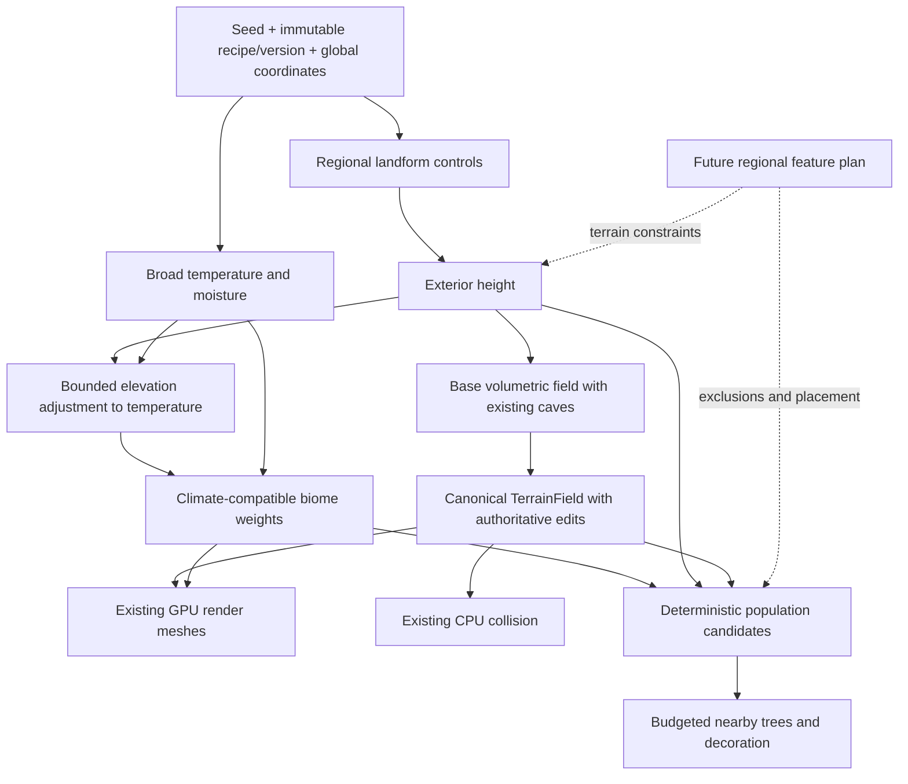

# Biome terrain generation: research and proposed architecture

Date: 2026-09-08. Status: research proposal, not implemented or performance-qualified.
Source reviewed: `d7c5da6`, with unrelated local scene, skill-cache and proposal changes present.

## Recommendation and scope

Build one deterministic, bounded terrain recipe that separates **landform**
(plains, hills, mountains) from **vegetation cover** (grassland, forest). Present
four recognizable environments without needing a separate generator for every
combination. Forested hills should arise naturally from the same controls.

Temperature and moisture are shared regional inputs to biome selection. Include
these simple deterministic fields in the first-slice contract, with the demo
restricted to a temperate palette. Future hot deserts and snowy biomes must have
intervening climate transitions rather than directly bordering one another.
This requirement was added during the 2026-09-08 design review; it supersedes the
initial proposal's independent forest-cover noise and deferral of temperature.

Prioritize frame pacing over generation throughput: admit less work when busy,
retain valid terrain coverage, and let distant detail and vegetation arrive
progressively. This preference does not permit missing collision beneath players,
unbounded queues, or permanent starvation.

The demonstration includes broad biome regions, smooth transitions, distinguishable
terrain silhouettes, simple ground appearance, and a small vegetation palette.
A forest must contain trees; a biome label or green tint alone is insufficient.
Use one or two existing suitable tree assets and restrained grass/rock dressing.
Asset selection and engine rendering support remain implementation checks.

Defer rivers, lakes, waterfalls, roads, buildings, cities, weather, ecology
simulation, erosion simulation, and a general procedural graph editor. Preserve
the ordering and ownership boundaries those features will need; do not implement
empty framework layers for them.

## 1. Current project constraints

Source, rather than older architectural summaries, establishes this starting point:

| Owner | Observed behavior | Consequence for this slice |
| --- | --- | --- |
| [ProceduralTerrainSdf.cs](../../Code/Voxels/ProceduralTerrainSdf.cs), `ProceduralTerrainSettings`, `SampleSurfaceHeight`, `SampleWorld` | Generator v5 uses seed plus base height, frequency and amplitude. Exterior density is Z minus a 2D simplex height; surface-relative noodle/cheese caves produce a volumetric field. | Replace the exterior recipe within the canonical field; preserve the cave responsibility and sign convention. |
| Same file, `LatticeSampler` | CPU sampling already reuses height per XY column in a build-local workspace. | Extend this existing reuse when adding regional controls; do not propose another height cache as if none existed. |
| [GPU meshing](../Architecture/GpuVoxelMeshing.md#regular-extraction-and-render-lifecycle), [GPU field mirror](../../Assets/shaders/voxels/voxel_sdf_v5.hlsl) | GPU extraction samples the field into a haloed lattice. Persistent meshes are drawn without evaluating the SDF each frame. | Additional noise costs generation, while vegetation, material shading and larger meshes can cost every frame. CPU density uploads would conflict with the current GPU rendering contract. |
| [TerrainField.cs](../../Code/Voxels/TerrainField.cs), [deformation contract](../Architecture/TerrainDeformation.md) | Canonical terrain composes the procedural base and immutable regional edit state. | Biomes cannot create independently mutable terrain arrays or bypass the edit boundary. |
| [TerrainFieldCodec.cs](../../Code/Voxels/TerrainFieldCodec.cs), [storage handoff](../Architecture/ChunkAuthoritativeStorage.md) | Saved data includes procedural settings; regional storage and replication already exist, with remaining qualification limits. | New settings/version identity must reach persistence and multiplayer together. Do not implement another save or transport system. |
| [Voxel foundation](../Architecture/VoxelChunkFoundation.md#spatial-contract) | 32 cells per chunk, 16 world units per cell, 512-unit chunks; shared samples and negative-coordinate floor rules. | Express scales in these units; keep boundaries independent of chunk load order. |
| `SampleGlobal` in the generator | Integer sample coordinates become float `Vector3` world positions before noise evaluation. | Current coordinates do not establish arbitrary-distance precision. Infinite streaming and infinite numerical range are different problems. |

The existing preparation, collision and GPU schedulers already have bounded work,
revision checks and lifecycle ownership. Extend their admission and telemetry only
where the new work requires it. Do not build a competing scheduler.

Current warm preparation uses batches of 256 with serialized worker ownership,
and its main-thread integration already has a 0.5 ms budget in
[VoxelManager.cs](../../Code/Voxels/VoxelManager.cs). New population work must fit
the total frame budget, not assume that an additional 0.5 ms is automatically free.

Older foundation/deformation overview text understates subsequent storage and
multiplayer implementation. Consult the latest storage handoff and ledger;
neither those features nor all historical performance gates are newly certified
by this research.

## 2. Evidence from shipped games and established research

These are strong reference cases, not a measured ranking of all terrain systems.
The transferable lessons below are our design judgments. No external timing is
treated as an s&box performance prediction.

| Reference and verified evidence | Adopt for Voxels3 | Transfer limit |
| --- | --- | --- |
| Mojang's [Minecraft Java 1.18 release notes](https://feedback.minecraft.net/hc/en-us/articles/4415128577293-Minecraft-Java-Edition-1-18) explicitly separate terrain shape/elevation from biome identity, allowing forests on hills. | Separate landform from cover; let a few continuous controls produce combinations. | Release notes establish behavior, not exact noise dimensions, spline implementation, thread scheduling or voxel-SDF parity. Do not claim to reproduce Minecraft's generator. |
| Wube's [Factorio noise expressions](https://www.factorio.com/blog/post/fff-390) describes coordinate-based evaluation without depending on what is already placed. [Better noise](https://www.factorio.com/blog/post/fff-112) describes reusing intermediate work across a chunk. | Pure coordinate queries, explicit random channels, and build-local reuse of repeated XY work. | Factorio is primarily a 2D tile world. Its expression language and compiler are unnecessary for four environments, and its optimization results do not predict volumetric costs. |
| Hello Games' [Continuous World Generation in No Man's Sky](https://www.gdcvault.com/play/1024265/Continuous_World_Generation_in__No_Man_s_Sky_) describes a continuous pipeline from voxel generation through polygonization, texturing, population and simulation. | Treat population and simulation as stages with readiness separate from terrain generation. | Only the public session overview was available for this review. Exact job graphs, concurrency, memory budgets and present-day implementation were not established. |
| Guerrilla's [GPU-Based Procedural Placement in Horizon Zero Dawn](https://www.guerrilla-games.com/read/gpu-based-procedural-placement-in-horizon-zero-dawn) describes rule-controlled runtime environment placement around the player. | Deterministic placement rules and bounded nearby realization; keep decorative detail separate from terrain density. | The talk page was inspected; its linked PDF failed to open. No undocumented placement algorithm is attributed to Guerrilla. Its GPU system and artist-authored world do not establish s&box support or an infinite terrain generator. |
| Génevaux et al., [Terrain Generation Using Procedural Models Based on Hydrology](https://perso.liris.cnrs.fr/egalin/Articles/2013-river-networks.pdf), SIGGRAPH 2013, constructs hierarchical drainage networks before combining terrain and river patches. | Reserve a future regional planning step before final local terrain and population. | The paper operates over an input domain; it does not solve our infinite cross-region drainage, runtime water simulation or frame budget. |

The combined lesson is regional coherence plus local evaluation. More noise
octaves alone do not create good environment composition, and a fast generator
does not guarantee a cheap populated scene.

## 3. One world recipe, several derived outputs

The following names describe responsibilities, not committed new classes or APIs.



The recipe identifies the immutable configuration shared by the modules below;
it is not one class implementing all their algorithms. Those modules own explicit
seed channels, landform evaluation, climate, biome selection and conservative
bounds under one field specification. A compact XY query returns height, landform weights, climate values,
biome weights and forest suitability. Density queries need only the landform,
height and cave terms for this slice; avoid evaluating climate when a consumer
only needs density. Slope can be derived from documented, fixed-offset samples of
that height when needed for placement. Avoid calculating it for every density
sample. Cache values only inside bounded jobs initially.

The manager owns recipe lifetime and existing pipeline integration. `TerrainField`
continues to own mutable terrain. A population owner holds only bounded derived
candidate/instance state; generated candidate identity does not depend on engine
object identity. Actual engine scene/resource mutations remain on their supported
threads. No new native API or worker-safe engine capability is assumed here.

Jobs capture recipe identity, world epoch, spatial key and relevant terrain
revision. Their owner cancels obsolete work and rejects late completions. A
recipe replacement invalidates all derivatives; a local edit invalidates only
affected terrain and population dependencies, including necessary halos.

### Deep modules and narrow contracts

Design-review requirement: organize generation into deep modules that hide
substantial implementation behind small, meaningful interfaces. A large script
with separate methods, or partial files sharing all of its private state, does
not satisfy this requirement. Module boundaries follow ownership and reasons to
change, rather than one class per noise operation or one generator per biome.

The following is the proposed first-slice responsibility map. Names are design
labels; concrete types and signatures will be chosen from the implementation.

| Module | Small consumer-facing contract | Complexity hidden inside / state owner |
| --- | --- | --- |
| Landforms | Evaluate unedited exterior height/landform weights at XY; conservatively bound height over an area. | Relief controls, ridges, octaves, blending, seed channels and height bounds. Immutable settings; build-local XY reuse belongs to its evaluator, not a global atlas. |
| Climate and biomes | Evaluate climate and normalized biome weights from XY and the landform result; validate configured climate coverage and transition constraints. | Temperature/moisture fields, elevation adjustment, eligibility, normalization and forbidden-neighbor separation. Keep climate and selection together initially because they jointly enforce the transition invariant. Immutable settings and a small biome definition table. |
| Base terrain field | Sample unedited volumetric density; conservatively classify a spatial bound; prepare the immutable GPU description. | Composition of the landform exterior and existing caves, CPU/HLSL agreement, sign conventions and field bounds. Evolve `ProceduralTerrainSdf` into this boundary rather than keeping an old sampler alongside a new one. |
| Surface appearance | Resolve derived terrain appearance from biome weights and surface properties. | Small palette, slope/height blending and edited/cave appearance rules; shader-side evaluation or emitted attributes selected during implementation. Owns visual configuration, never authoritative density or new mutable voxel materials. |
| Population | Request/retire candidates for a bounded area and source revision; return bounded instance descriptors and readiness. | Stable IDs, spacing/neighbor halos, suitability, support checks, cancellation and candidate residency. This owner also manages the bounded realization queue; engine operations occur only on supported threads. |

Existing `TerrainField` remains the separate authoritative mutable-state module.
Its canonical field access and commit/invalidation boundary are reused. Render
meshing, collision, storage and replication stay downstream with their existing
owners; none implements its own biome selection or edits the procedural recipe.

An immutable recipe configuration supplies each module only its relevant settings
plus shared world identity. Its configuration/version validation remains canonical
and includes all field, climate and population dependencies. No module receives
the manager, scene, service locator or a mutable catch-all world context merely to
obtain its inputs. Results are immutable values or bounded owned buffers with an
explicit lifetime, not references into another module's mutable internals.

Dependency direction is explicit:

```text
landforms -> base terrain field -> TerrainField -> render/collision
landform result + coordinates -> climate/biomes -> appearance/population
TerrainField regional reader -> population support checks
```

The arrows describe consumed inputs, not mandatory intermediate arrays or serial
whole-world passes. The generation boundary may call landform evaluation directly
and reuse results in a build-local workspace. Consumers ask for density, surface
semantics or population as needed; a density-only collision query need not pay
for climate, appearance or tree generation. Avoid virtual dispatch per sample,
allocations per query and a universal result that eagerly computes every module.
Use concrete calls and compact values initially; introduce interfaces only where
they provide an actual boundary benefit, not to satisfy a class-count target.

`VoxelManager` owns lifecycle wiring: validate/apply configuration, pass bounded
requests to existing schedulers, and publish or retire completed work. It must not
contain biome eligibility tables, noise recipes, tree-spacing rules, appearance
selection or future road/river algorithms. This slice does not redesign unrelated
manager responsibilities; it prevents the new subsystem from expanding that
coupling. A new coordinator may be justified by actual lifecycle complexity, but
must not become another all-purpose generator.

For each requested region, the owner admits work under its existing budget,
captures immutable inputs, computes with bounded scratch, and integrates results
only if the world epoch, recipe and relevant regional revisions still match.
Modules do not start hidden background tasks or bypass scheduler admission.
Pure evaluation can run on workers with supported data; engine realization
remains at the explicit integration boundary. A cancelled result's owner releases
its scratch and retained input references. Account for buffers and candidate
caps per job and per active interest, not just per module instance.

Keep CPU/HLSL implementations aligned with the same responsibility boundaries:
landform arithmetic and base-field composition have corresponding shader includes
when required, and semantic consumers share one biome rule specification. Do not
introduce biome arithmetic into the mesher itself. A general cross-language code
generator is not required by this proposal; manually mirrored rules remain an
explicit parity and versioning obligation.

New biomes should normally add definition/palette/population data inside these
owners. A genuinely new landform algorithm changes Landforms; a new cave algorithm
changes the base-field implementation; neither requires editing the manager or
collision/streaming code. Future regional feature planning gets its own module
only when implemented, supplying immutable bounded constraints to these existing
inputs. No empty planner interface or plugin registry is needed now.

Before accepting implementation, review that each module hides its algorithm,
owns its state/lifetime and exposes only the operations its real consumers need.
Reject cycles, duplicated samplers, shared mutable configuration, one-line wrapper
layers, per-biome subclasses with duplicated pipelines, and a manager that reaches
into module internals. Splitting files alone is not architectural separation.

## 4. Small biome recipe

### When biome selection happens

There is no runtime biome system implemented by this research. In the proposed
pipeline, regional climate and landform controls are evaluated first; exterior
height then permits an elevation adjustment to temperature; biome weights are
selected from those inputs before materials and vegetation are generated.
Density and biome selection share their inputs but have separate outputs.
The first slice does not use a selected biome label to determine terrain height.

"Height first" means the landform height calculation precedes height-dependent
biome selection. It does not mean allocating a full heightmap or finishing the
world before choosing biomes. Broad climate fields can be evaluated independently
of landforms; only the elevation adjustment needs their result. In the first slice,
the landform exterior is the final unedited exterior because there are no feature
constraints. Caves still make the complete terrain volumetric.

As future features arrive, distinguish preliminary regional elevation from the
final constrained exterior. Regional drainage/site/road planning consumes the
preliminary context and supplies bounded terrain constraints before final field
composition and population. The planner must not query the final field that
depends on its own output. If biome-specific local relief is later needed, assign
it an explicit bounded refinement step and stable climate reference height;
do not let final height and biome selection recursively redefine one another.

This is logical dependency order, not an up-front pass over the infinite world.
Any requested coordinate can evaluate the same regional fields on demand, without
generating neighboring chunks or consulting previously placed biomes. Therefore
the biome distribution is determined by seed/configuration before chunks load,
while its values are computed locally as consumers need them. Trees and other
objects are realized later, after suitable terrain/support is ready.

### Landform and cover

Use a low-frequency relief field to derive normalized plains/hills/mountain
weights. Use shared moisture and temperature to derive forest suitability, then
apply bounded local variation to create openings within suitable forest. Elevation
and slope suppress trees on peaks and steep faces. Two analytic climate fields
are sufficient initially; atmospheric simulation and a six-dimensional biome
lookup remain unnecessary for the requested palette.

### Climate fields and compatible transitions

Use separately salted, continuous low-frequency temperature and moisture fields
in normalized [0,1] units. These are art-directed climate indices, not degrees
Celsius, relative humidity measurements or a weather simulation. Moisture means
long-term habitat wetness for biome selection. Keep their scale, range and seed
channels in the versioned recipe. Start with broad climate variation at least
as large as the forest regions; small placement noise must not override climate
eligibility or create isolated incompatible biomes.

For the demo, constrain the configured temperature output to a temperate interval;
moisture controls the grassland-to-forest transition. Temperature is present in
the query and suitability rules even though desert/snow definitions and assets
remain deferred. Do not select an unimplemented extreme biome and then substitute
forest for it. Adding a wider climate range and new biome definitions later is an
explicit recipe-version change, not a promise that existing worlds stay identical.

Use unedited exterior elevation to lower effective temperature through a bounded
continuous adjustment. The climate reference height, adjustment strength and
gradient limit belong to the recipe. Avoid a feedback loop: height produces the
adjustment, and selected biome weights do not alter that height in this slice.
Player excavation must not relocate regional climate or change an entire forest
into another biome; edited terrain still affects local support and appearance.

Future biome definitions have compact eligibility ranges and smooth suitability
weights over temperature/moisture, with elevation/slope constraints where needed.
Normalize only eligible weights. The palette must cover the configured climate
domain with compatible intermediate environments; reject a configuration with
uncovered intervals instead of assigning the nearest incompatible biome.

| Future climate region | Possible environment; not first-slice content |
| --- | --- |
| Hot and dry | Hot desert |
| Warm and moderately dry | Dry grassland or scrub transition |
| Temperate, with varying moisture | Grassland or forest |
| Cool | Cool grassland or woodland transition |
| Cold | Tundra/snow environment according to its eligibility rules |

The specific forbidden pairing is **hot desert against a snow biome**. Moisture
alone cannot enforce this: dry locations can occupy different temperature ranges.
Hot-desert and snow eligibility supports must be separated in effective
temperature by an interval assigned to intermediate environments. This applies
to material and population weights as well as the displayed dominant label.
Do not use an unrestricted nearest-biome lookup or random per-chunk assignment.

Smooth noise alone is not a minimum-distance guarantee. Define a minimum
world-space transition width in the recipe and bound the spatial gradient of the
complete effective temperature, including elevation adjustment and any future
warping. If the gap between incompatible eligibility supports is `deltaT` and
the global gradient bound is `G`, their spatial separation is at least
`deltaT / G` for positive `G`; require this to meet the configured width. With
zero gradient the field cannot cross both supports. Derive conservative bounds
from the chosen field operations rather than estimating them only from samples.
If the elevation term violates the bound, reduce or broaden that adjustment;
do not exempt steep mountains from the requested transition rule. Snowy peaks
remain possible later with a sufficient intervening elevation/climate band.

Freeze climate ranges, eligibility supports, blend widths and the spatial width
before validation. Exact values are art-tuning decisions still to make; no
numerical adjacency guarantee is claimed until the recipe and its bounds are
implemented and checked. The first slice validates climate continuity with its
temperate palette. Desert/snow eligibility and visible adjacency tests become
mandatory when those environments are added, without adding them to this demo.

### Exterior shape

| Demonstration environment | Terrain character | Cover and appearance |
| --- | --- | --- |
| Grassland | Broad gentle terrain, low relief | Mostly grass surface, very sparse trees |
| Forest | Gentle ground or rolling foothills | Clustered trees with openings; sparse understory |
| Hills | Rounded medium-scale rises and valleys | Grass or forest according to the same cover field |
| Mountains | Broad raised mass with connected ridged detail and foothills | Increasing rock exposure; declining tree density |

Use one shared broad elevation field plus weighted relief contributions. One
possible fixed recipe, to finalize during implementation, is:

```text
t = smoothstep(a, b, reliefControl)
m = smoothstep(c, d, reliefControl)      with a < b <= c < d
wPlain = 1 - t
wHill  = t * (1 - m)
wMount = t * m                         sum of weights = 1

height = base + broadElevation
       + wPlain * gentleDetail
       + wHill  * roundedRelief
       + wMount * (mountainUplift + ridgedRelief)
```

All fields share global coordinates and fixed seed channels. Use a bounded
small number of noise evaluations; begin with one contribution per responsibility
and at most two detail octaves where visibly necessary. Smooth the ridge profile
if its cusp produces undesirable silhouettes or normals. Broad mountain masks
should dominate small noise so mountain regions read as ranges, not spikes.

Blend the continuous geometry controls before classification. A dominant label
is useful for inspection, but must not drive a hard switch between separate
height functions. Forest cover uses a smooth probability ramp, creating thinning
edges rather than rectangular walls of trees. No chunk owns a biome identity.

Proposed art-tuning starting ranges, not fixed validation inputs or promises:

| Quantity | Initial range |
| --- | --- |
| Broad landform variation | 64–128 chunks (32,768–65,536 units) |
| Broad temperature/moisture variation | 64–128 chunks (32,768–65,536 units), subject to transition-width bounds |
| Within-climate forest openings/cover variation | 16–48 chunks (8,192–24,576 units) |
| Foothill/relief detail | 4–16 chunks (2,048–8,192 units) |
| Gentle relief amplitude | 64–192 units |
| Hill relief amplitude | 256–768 units |
| Mountain uplift/relief envelope | 1,024–3,072 units |

These noise scales do not guarantee exact biome diameters or traversal times.
Select one exact configuration before runtime acceptance, record it in the ledger,
and assess the silhouettes from player height and existing LOD distances. Existing
scenario inputs remain unchanged; these ranges cannot be used to tune a test to pass.

### Volumetric correctness and bounds

Keep negative density solid and zero as the surface. `z - height(x,y)` is an
implicit field, generally not an exact Euclidean signed distance. Do not quietly
normalize it by slope: that would change density magnitudes and edit response.
Retain the existing cave composition, with its depth measured against the new
surface, and apply canonical edits afterward. Higher terrain relocates cave
envelopes even when their recipe is unchanged; that requires a generator version.

Every new field operation must have conservative bounds. For nonnegative weights
summing to one, a global bound can contain every component's relief range; add
the broad elevation range separately. Local tightening must account for changing
weights, all octaves, ridge transforms and floating-point padding. Sampled corner
min/max alone cannot prove a region empty. Compose cave and edit bounds through
the existing owner. If uncertain, classify as potentially containing a surface.

Loose bounds are correct but may admit many more chunks and meshes. Measure both
bound cost and false-positive work; mountains also increase vertical surface
coverage and geometry independently of noise evaluation cost.

Keep the same field at all LODs. Dropping density octaves by LOD can move the
surface and break transitions. Frequency filtering would need its own measured
seam-preserving design; it is outside this demonstration.

## 5. Forests, grass and surface appearance

First use a small material palette driven by cover, elevation and slope. Keep
visual material weights derived from the recipe rather than expanding authoritative
voxel material storage. Prefer storing cheap derived shading attributes during
mesh production if profiling shows repeated shader noise expensive; changing the
vertex layout is a measured implementation choice, not assumed free. Do not run
the full terrain generator per pixel. Existing edited and cave surfaces also
need sensible rock/soil appearance without using an exterior height as collision.

For trees, propose a fixed global candidate grid with stable per-cell hashed
jitter and a small fixed candidate count. Hash `(seed, population version,
integer cell, candidate index, channel)` using an explicitly specified algorithm.
Use independent channels for position, acceptance, species, scale and rotation.
This is our simple proposal, not a claim about Horizon's internal algorithm.

Accept candidates according to forest suitability, slope and final terrain
support. Find support against the canonical edited field/current collision in a
bounded vertical interval; reject cave/overhang or ambiguous support instead of
assuming the unedited surface is the final ground. A bounded neighboring-cell
comparison with stable priority breaks spacing conflicts. Include a halo at
least as large as the maximum exclusion distance and assign each candidate to
one half-open cell. No dependence on which chunk generated first is allowed.

Realize near terrain first, then trees, then optional understory. Rendering needs
bounded instance counts, distance culling, LOD and restrained shadows. Verify
installed s&box APIs and asset capabilities before selecting batching/instancing;
do not default to thousands of independently updating components. Collidable
trunks belong to the nearby authoritative gameplay interests. Decorative grass
can be client-local and reduced without changing shared terrain or tree identity.

For the demo, terrain edits revalidate affected tree support and remove invalid
derived instances. Logging, persistent felled trees and harvesting are deferred;
before adding those, destruction state must use authoritative stable IDs so
revisiting does not resurrect harvested trees. Population completion must not
hold terrain publication hostage.

## 6. Frame pacing takes precedence

Retain the CPU/GPU division: CPU prepares/classifies and handles collision; GPU
evaluates the canonical visual field and produces persistent geometry. Mirrored
CPU/HLSL arithmetic is one specification with two backends, not permission for
two recipes. Shared-coordinate equality within a backend and CPU/GPU agreement
need separate validation; matching seeds alone proves neither.

Start with existing worker limits and incremental integration. Extend the CPU
column sampler's intermediate reuse. Profile GPU XY repetition before adding
another pass or persistent cache; any later GPU column cache is derived scratch
with defined halo, lifetime and memory accounting, not a CPU-uploaded heightfield.

| Work | Proposed policy |
| --- | --- |
| Gameplay readiness | Prioritize nearby collision and edit dependencies across all players; hold unsafe movement using the existing readiness mechanism. |
| Terrain coverage | Finish required transition/publication groups and retain valid committed geometry while replacements are pending. |
| New/distant detail | Bound admission by queue counts, bytes and estimated cost; age requests to prevent starvation. |
| Population | Separate low-priority queue with per-frame realization and resident-instance caps. |
| Overload/teleport | Cancel obsolete requests, drain only capped completions, defer cosmetic work and use explicit readiness. Never synchronously catch up the entire world. |
| Teardown/configuration | Cancel and reject by epoch/recipe/dependency identity; release references when jobs retire. |

Main-thread admission timing does not bound the duration of a GPU dispatch or
native physics/resource creation. Measure those atomic operations and reduce batch
granularity if one operation violates the budget. More workers can increase
contention, allocation pressure and GPU backlog even if chunks finish faster.

Proposed initial engineering targets: at most 0.5 ms of added main-thread biome
and population integration per frame; begin with at most one terrain batch
admission per update under the existing scheduler caps; aim for at most 1 ms of
incremental GPU generation work per frame when measured. These are starting
targets, not supported limits or accepted regression allowances. A single batch
can exceed them. Existing total frame/tail criteria take precedence; a new global
FPS target cannot replace the project's current acceptance contract.

Track CPU generation p50/p95/p99, sample throughput, GPU generation time, main
integration p95/p99, frame-time tails, geometry bytes, collision cooking, allocations,
resident metadata/instances, backlog age and completion rates. Separate moving,
stationary and cold-start windows. Cosmetic quality may fall under pressure;
seed, density, authoritative objects and accepted edits may not.

Memory must scale with active interests, not exploration history. Bound queued,
running and completed job memory as well as resident output; count retained
snapshots and in-flight buffers. Add no permanent biome atlas: pure fields can be
recomputed. Future planner caches must also have explicit residency limits.

## 7. Supporting future features without implementing them

Future regional planning must operate at a larger scale than meshing chunks:

```text
regional landform and climate context
  -> drainage and water-level constraints
  -> settlement suitability and sites
  -> connecting roads, crossings and grading
  -> final terrain constraints + exclusions
  -> local field, surface appearance and population
  -> authoritative player changes
```

This order avoids a forest needing to know how to generate a city or a road
discovering buildings only after they spawn. Future bounded feature descriptors
need a stable ID, deterministic owner, influence bounds including falloff,
version and a specified composition order. Geometry-changing authored/generated
constraints belong in the canonical base recipe before player edits. Changes to
an already active world must enter the established mutation/invalidation lifecycle,
never silently overwrite committed player work.

Roads and rivers cannot be independent chunk decorations. Neighboring planning
regions must agree on edge connections and ownership using shared coarse inputs
or authoritative plans. Bound dependencies rather than recursively discovering
the entire upstream world. No-crossing/flow and settlement spacing rules need a
separate design when those features are selected.

In particular, reserving a height-modifier stage does not solve hydrology. Valid
drainage may require changing the broad terrain recipe. Rivers need direction,
outlets and basin levels; lakes need consistent containment; waterfalls need
separate water geometry. The demonstration should permit a future generator-version
change instead of promising unchanged landscapes after adding realistic water.

The first slice needs pure regional landform/climate queries, compatible biome
weights, stable coordinates, explicit versions and population separated from
density. Do not build feature registries,
road splines, water masks, city graphs or planner caches yet.

## 8. Determinism, saved worlds and large coordinates

World identity must include seed, generator version, every field-shaping parameter,
climate configuration, biome eligibility/transition rules and a canonical
configuration hash. Include population recipe/asset identity for
shared collidable objects. Use fixed field ordering and float encoding for hashes;
never process-dependent `GetHashCode`, culture-sensitive strings or mutable random
sequences. CPU and GPU must agree on hash wraparound, floor rules and operation
semantics. Scheduling controls execution order, never generation results.

For the demo, recommend a new explicit world/generator version. Preserve existing
saves intact and fail clearly on incompatible identity; do not reinterpret v5
edits over new terrain or silently reset the user's save. This research authorizes
no reset. Keeping two runtime generator variants solely for old demo saves would
conflict with the project's single canonical implementation rule; migration is a
separate decision if old-world continuation is required.

Validate identical recipes in host/client join and persistence paths. Absolute
edited state does not eliminate the need for base-field agreement elsewhere.
Keep existing regional storage and transport; update their identity checks rather
than creating biome-specific replication.

Long-term coordinate identity should use a sufficiently wide integer spatial key
plus local offsets; rendering/physics can use an origin-relative frame. Noise
lattice hashing also needs large-coordinate decomposition before lossy conversion
to float. Rebasing only scene transforms cannot fix precision already lost in the
generator. This is a cross-system change, not a casual `Vector3` replacement.
For this slice, specify and qualify a finite supported travel envelope, checked
arithmetic and explicit rejection outside it. Do not advertise arbitrary-distance
correctness until generation, edits, persistence, networking, physics and LOD
origins share a tested coordinate contract.

The existing edit-format owner already defines `MaximumWorldCoordinate = 1048576`
world units in `TerrainField`; use that as a ceiling to investigate, not proof
that every subsystem is qualified to that distance. The manager also restricts
seeds to [-16,777,216, 16,777,216] for exact GPU transport. Preserve this restriction
unless seed transport itself is deliberately redesigned and validated.

## 9. Alternatives and decisions

| Alternative | Decision |
| --- | --- |
| One generator selected per biome/chunk | Reject: hard boundaries and duplicated terrain ownership; normalized global controls are simpler. |
| Voronoi biome regions with blended borders | Defer: useful for explicit territories, but adds site/neighbor rules and is unnecessary for the four-environment demo. |
| Full climate/tectonic/erosion simulation | Defer physical simulation; adopt two simple temperature/moisture fields and bounded climate transitions now. Nonlocal atmospheric, tectonic and erosion models remain disproportionate. |
| Generic noise graph or plugin framework | Reject for this slice: a fixed recipe is easier to bound, mirror and version. Revisit only with actual authoring needs. |
| Bake all base density on CPU and upload it | Reject under the current GPU field contract; would change rendering ownership and storage costs. |
| Maximum parallel generation | Reject as default: throughput can compete with frame-critical CPU/GPU work. |
| GPU-only population including gameplay truth | Reject for shared objects: clients may vary decorative density, but authoritative collision/interaction requires stable identities. |
| Add more octaves for realism | Use only when visible results justify measured cost; coherent macro shape and asset composition come first. |

## 10. Implementation sequence and acceptance

1. **Freeze inputs and compatibility.** Confirm the current source and effective
   scene settings; select a finite coordinate envelope and new world identity.
   Record exact proposed tests before running them. Capture a comparable pre-change
   figure-eight if the ledger has no accepted comparable baseline.
2. **Landform and climate modules.** Establish the deep-module contracts in section 3
   while implementing regional controls, height, temperature,
   moisture, compatible biome weights, transition bounds and cave composition,
   CPU/GPU mirror, conservative bounds, and settings/version propagation together.
   Validate playable geometry before adding trees. Remove superseded recipe paths
   in the same change; Git preserves the old version.
3. **Appearance and population modules.** Add the small palette and deterministic bounded
   population, near collision, culling and staged realization. Verify visible
   transitions, support after edits, and actual steady-state rendering cost.
4. **Qualification.** Repeat the canonical performance route unchanged, plus fixed
   biome coverage and lifecycle cases through the real playable world. Resolve
   unexplained regressions before accepting implementation.

The following are requirements for future ledger scenarios, not claims that new
scenarios have been executed or fully parameterized:

| Area | Required evidence and pass criteria |
| --- | --- |
| Demonstration | Frozen seed/settings, coordinates and camera views show all four recognizable environments; forests contain trees, hills and mountains have distinct silhouettes, and transitions are visually continuous. Record screenshots and the inspected locations. |
| Climate | First slice: fixed coordinate transects establish deterministic continuous temperature/moisture, temperate output and climate-driven forest weights independent of load order. Check analytical gradient bounds against the configured transition width. Future extreme-biome slice: zero hot-desert/snow support overlap or direct adjacency, with measured intermediate-band width at least the frozen minimum, including steep elevation transitions and negative coordinates. Sampled transects support, but do not replace, the bound derivation. |
| Boundaries | Shared samples and candidate IDs agree across positive/negative chunk and population-cell boundaries; no duplicate owned trees; zero observed cracks in selected regular/LOD transition views. |
| CPU/GPU | Compare production samples/geometry and collision over steep slopes, peaks, near-zero density and edited seams. Freeze numeric tolerance before the first run based on cell scale and existing arithmetic; disclose sign disagreements and near-zero cases explicitly. |
| Bounds | Zero false-empty classifications for the production field samples/geometry exercised in the fixed cases; review conservative derivation as well. Sampling alone is not a global proof. |
| Lifecycle | Revisit and restart preserve exact recipe/candidate identities and edited sample fingerprints; stale jobs never publish; edited support removes affected trees; world mismatch fails without changing live state. |
| Coordinate range | Freeze near-origin, negative and near-limit positions and validate density, seams, candidate identity and collision; overflow/out-of-range input fails explicitly. |
| Performance | Preserve the existing figure-eight scenario/version, player path, settings and criteria. Compare frame rate, p95/p99 pacing, chunks/streaming, memory and allocations with the accepted comparable baseline; record all failures. |
| Population load | Freeze near-tree count caps, assets/LOD/shadows, player count, distances, warmup and timed windows; measure realization spikes and stationary rendering as well as moving generation. |
| Overload | Fixed rapid travel/teleport and separated-player interests have bounded queues/memory, preserved gameplay readiness and eventual service after motion stops; freeze completion deadlines before execution. |

Changing the generator changes the workload even if the route is identical.
Retain v5 results as historical controls and label new-recipe measurements
accordingly. If the canonical scenario pins generator identity and cannot run
unchanged, follow the scenario-version policy and obtain explicit approval for
the workload change before claiming a new baseline. Slower completion is a design
preference, not permission to waive an existing measured acceptance threshold.

Use the existing figure-eight runner and production entry points. No separate
test project, scene, reference mesher or synthetic generator is proposed. Exact
parameters, thresholds, hardware/engine/source identity and every run belong in
[ValidationResults.md](../ValidationResults.md). Prior storage acceptance and
unresolved performance findings remain intact.

In particular, the ledger records user acceptance of current performance on
2026-09-08, following run `51b861e066d7469b80b78327319393e5` (736.10394 average
FPS; CPU frame p95/p99 2.1717/4.4676 ms; 4,191,648,160 allocated bytes).
That run explicitly was not a matched causal baseline and did not pass the whole
scenario: its stationary camera/support conditions differed. Respect the user's
acceptance without relabeling it a clean comparable control or reopening storage
qualification. Choose baseline evidence by comparability, not by highest FPS.

## Research completion and remaining uncertainty

This document makes the architecture reviewable; it changes no runtime behavior.
Document links, current-source claims and scope were checked. No in-world run,
benchmark, scene mutation or visual qualification was performed for this research.

Implementation still needs asset/API selection, exact recipe tuning (including
climate ranges, gradient limits and minimum transition width), coordinate
envelope, CPU/GPU tolerance, measured admission limits and comparable performance
evidence. Future hydrology and city planning remain deliberately unresolved.
When implemented, move adopted current contracts into the existing foundation,
GPU, deformation and storage owners; retain this document as decision history.
