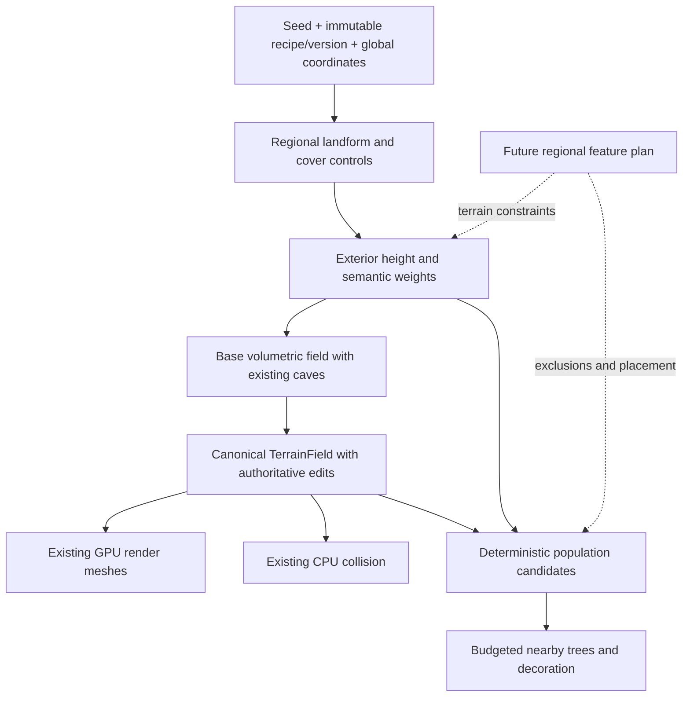

# Biome terrain generation: research and proposed architecture

Date: 2026-09-08. Status: research proposal, not implemented or performance-qualified.
Source reviewed: `d7c5da6`, with unrelated local scene, skill-cache and proposal changes present.

## Recommendation and scope

Build one deterministic, bounded terrain recipe that separates **landform**
(plains, hills, mountains) from **vegetation cover** (grassland, forest). Present
four recognizable environments without needing a separate generator for every
combination. Forested hills should arise naturally from the same controls.

Prioritize frame pacing over generation throughput: admit less work when busy,
retain valid terrain coverage, and let distant detail and vegetation arrive
progressively. This preference does not permit missing collision beneath players,
unbounded queues, or permanent starvation.

The demonstration includes broad biome regions, smooth transitions, distinguishable
terrain silhouettes, simple ground appearance, and a small vegetation palette.
A forest must contain trees; a biome label or green tint alone is insufficient.
Use one or two existing suitable tree assets and restrained grass/rock dressing.
Asset selection and engine rendering support remain implementation checks.

Defer rivers, lakes, waterfalls, roads, buildings, cities, weather, ecology
simulation, erosion simulation, and a general procedural graph editor. Preserve
the ordering and ownership boundaries those features will need; do not implement
empty framework layers for them.

## 1. Current project constraints

Source, rather than older architectural summaries, establishes this starting point:

| Owner | Observed behavior | Consequence for this slice |
| --- | --- | --- |
| [ProceduralTerrainSdf.cs](../../Code/Voxels/ProceduralTerrainSdf.cs), `ProceduralTerrainSettings`, `SampleSurfaceHeight`, `SampleWorld` | Generator v5 uses seed plus base height, frequency and amplitude. Exterior density is Z minus a 2D simplex height; surface-relative noodle/cheese caves produce a volumetric field. | Replace the exterior recipe within the canonical field; preserve the cave responsibility and sign convention. |
| Same file, `LatticeSampler` | CPU sampling already reuses height per XY column in a build-local workspace. | Extend this existing reuse when adding regional controls; do not propose another height cache as if none existed. |
| [GPU meshing](../Architecture/GpuVoxelMeshing.md#regular-extraction-and-render-lifecycle), [GPU field mirror](../../Assets/shaders/voxels/voxel_sdf_v5.hlsl) | GPU extraction samples the field into a haloed lattice. Persistent meshes are drawn without evaluating the SDF each frame. | Additional noise costs generation, while vegetation, material shading and larger meshes can cost every frame. CPU density uploads would conflict with the current GPU rendering contract. |
| [TerrainField.cs](../../Code/Voxels/TerrainField.cs), [deformation contract](../Architecture/TerrainDeformation.md) | Canonical terrain composes the procedural base and immutable regional edit state. | Biomes cannot create independently mutable terrain arrays or bypass the edit boundary. |
| [TerrainFieldCodec.cs](../../Code/Voxels/TerrainFieldCodec.cs), [storage handoff](../Architecture/ChunkAuthoritativeStorage.md) | Saved data includes procedural settings; regional storage and replication already exist, with remaining qualification limits. | New settings/version identity must reach persistence and multiplayer together. Do not implement another save or transport system. |
| [Voxel foundation](../Architecture/VoxelChunkFoundation.md#spatial-contract) | 32 cells per chunk, 16 world units per cell, 512-unit chunks; shared samples and negative-coordinate floor rules. | Express scales in these units; keep boundaries independent of chunk load order. |
| `SampleGlobal` in the generator | Integer sample coordinates become float `Vector3` world positions before noise evaluation. | Current coordinates do not establish arbitrary-distance precision. Infinite streaming and infinite numerical range are different problems. |

The existing preparation, collision and GPU schedulers already have bounded work,
revision checks and lifecycle ownership. Extend their admission and telemetry only
where the new work requires it. Do not build a competing scheduler.

Current warm preparation uses batches of 256 with serialized worker ownership,
and its main-thread integration already has a 0.5 ms budget in
[VoxelManager.cs](../../Code/Voxels/VoxelManager.cs). New population work must fit
the total frame budget, not assume that an additional 0.5 ms is automatically free.

Older foundation/deformation overview text understates subsequent storage and
multiplayer implementation. Consult the latest storage handoff and ledger;
neither those features nor all historical performance gates are newly certified
by this research.

## 2. Evidence from shipped games and established research

These are strong reference cases, not a measured ranking of all terrain systems.
The transferable lessons below are our design judgments. No external timing is
treated as an s&box performance prediction.

| Reference and verified evidence | Adopt for Voxels3 | Transfer limit |
| --- | --- | --- |
| Mojang's [Minecraft Java 1.18 release notes](https://feedback.minecraft.net/hc/en-us/articles/4415128577293-Minecraft-Java-Edition-1-18) explicitly separate terrain shape/elevation from biome identity, allowing forests on hills. | Separate landform from cover; let a few continuous controls produce combinations. | Release notes establish behavior, not exact noise dimensions, spline implementation, thread scheduling or voxel-SDF parity. Do not claim to reproduce Minecraft's generator. |
| Wube's [Factorio noise expressions](https://www.factorio.com/blog/post/fff-390) describes coordinate-based evaluation without depending on what is already placed. [Better noise](https://www.factorio.com/blog/post/fff-112) describes reusing intermediate work across a chunk. | Pure coordinate queries, explicit random channels, and build-local reuse of repeated XY work. | Factorio is primarily a 2D tile world. Its expression language and compiler are unnecessary for four environments, and its optimization results do not predict volumetric costs. |
| Hello Games' [Continuous World Generation in No Man's Sky](https://www.gdcvault.com/play/1024265/Continuous_World_Generation_in__No_Man_s_Sky_) describes a continuous pipeline from voxel generation through polygonization, texturing, population and simulation. | Treat population and simulation as stages with readiness separate from terrain generation. | Only the public session overview was available for this review. Exact job graphs, concurrency, memory budgets and present-day implementation were not established. |
| Guerrilla's [GPU-Based Procedural Placement in Horizon Zero Dawn](https://www.guerrilla-games.com/read/gpu-based-procedural-placement-in-horizon-zero-dawn) describes rule-controlled runtime environment placement around the player. | Deterministic placement rules and bounded nearby realization; keep decorative detail separate from terrain density. | The talk page was inspected; its linked PDF failed to open. No undocumented placement algorithm is attributed to Guerrilla. Its GPU system and artist-authored world do not establish s&box support or an infinite terrain generator. |
| Génevaux et al., [Terrain Generation Using Procedural Models Based on Hydrology](https://perso.liris.cnrs.fr/egalin/Articles/2013-river-networks.pdf), SIGGRAPH 2013, constructs hierarchical drainage networks before combining terrain and river patches. | Reserve a future regional planning step before final local terrain and population. | The paper operates over an input domain; it does not solve our infinite cross-region drainage, runtime water simulation or frame budget. |

The combined lesson is regional coherence plus local evaluation. More noise
octaves alone do not create good environment composition, and a fast generator
does not guarantee a cheap populated scene.

## 3. One world recipe, several derived outputs

The following names describe responsibilities, not committed new classes or APIs.



The recipe owns immutable parameters, explicit seed salts, landform weights,
height evaluation and conservative bounds. A compact XY query returns height,
landform weights and forest suitability; density queries add Z and caves through
the same recipe. Slope can be derived from documented, fixed-offset samples of
that height when needed for placement. Avoid calculating it for every density
sample. Cache values only inside bounded jobs initially.

The manager owns recipe lifetime and existing pipeline integration. `TerrainField`
continues to own mutable terrain. A population owner holds only bounded derived
candidate/instance state; generated candidate identity does not depend on engine
object identity. Actual engine scene/resource mutations remain on their supported
threads. No new native API or worker-safe engine capability is assumed here.

Jobs capture recipe identity, world epoch, spatial key and relevant terrain
revision. Their owner cancels obsolete work and rejects late completions. A
recipe replacement invalidates all derivatives; a local edit invalidates only
affected terrain and population dependencies, including necessary halos.

## 4. Small biome recipe

### Landform and cover

Use a low-frequency relief field to derive normalized plains/hills/mountain
weights. Use a separately salted broad cover field for forest density. Elevation
and slope suppress trees on peaks and steep faces. A temperature simulation and
six-dimensional biome lookup are unnecessary for the requested palette.

| Demonstration environment | Terrain character | Cover and appearance |
| --- | --- | --- |
| Grassland | Broad gentle terrain, low relief | Mostly grass surface, very sparse trees |
| Forest | Gentle ground or rolling foothills | Clustered trees with openings; sparse understory |
| Hills | Rounded medium-scale rises and valleys | Grass or forest according to the same cover field |
| Mountains | Broad raised mass with connected ridged detail and foothills | Increasing rock exposure; declining tree density |

Use one shared broad elevation field plus weighted relief contributions. One
possible fixed recipe, to finalize during implementation, is:

```text
t = smoothstep(a, b, reliefControl)
m = smoothstep(c, d, reliefControl)      with a < b <= c < d
wPlain = 1 - t
wHill  = t * (1 - m)
wMount = t * m                         sum of weights = 1

height = base + broadElevation
       + wPlain * gentleDetail
       + wHill  * roundedRelief
       + wMount * (mountainUplift + ridgedRelief)
```

All fields share global coordinates and fixed seed channels. Use a bounded
small number of noise evaluations; begin with one contribution per responsibility
and at most two detail octaves where visibly necessary. Smooth the ridge profile
if its cusp produces undesirable silhouettes or normals. Broad mountain masks
should dominate small noise so mountain regions read as ranges, not spikes.

Blend the continuous geometry controls before classification. A dominant label
is useful for inspection, but must not drive a hard switch between separate
height functions. Forest cover uses a smooth probability ramp, creating thinning
edges rather than rectangular walls of trees. No chunk owns a biome identity.

Proposed art-tuning starting ranges, not fixed validation inputs or promises:

| Quantity | Initial range |
| --- | --- |
| Broad landform variation | 64–128 chunks (32,768–65,536 units) |
| Forest/grassland variation | 16–48 chunks (8,192–24,576 units) |
| Foothill/relief detail | 4–16 chunks (2,048–8,192 units) |
| Gentle relief amplitude | 64–192 units |
| Hill relief amplitude | 256–768 units |
| Mountain uplift/relief envelope | 1,024–3,072 units |

These noise scales do not guarantee exact biome diameters or traversal times.
Select one exact configuration before runtime acceptance, record it in the ledger,
and assess the silhouettes from player height and existing LOD distances. Existing
scenario inputs remain unchanged; these ranges cannot be used to tune a test to pass.

### Volumetric correctness and bounds

Keep negative density solid and zero as the surface. `z - height(x,y)` is an
implicit field, generally not an exact Euclidean signed distance. Do not quietly
normalize it by slope: that would change density magnitudes and edit response.
Retain the existing cave composition, with its depth measured against the new
surface, and apply canonical edits afterward. Higher terrain relocates cave
envelopes even when their recipe is unchanged; that requires a generator version.

Every new field operation must have conservative bounds. For nonnegative weights
summing to one, a global bound can contain every component's relief range; add
the broad elevation range separately. Local tightening must account for changing
weights, all octaves, ridge transforms and floating-point padding. Sampled corner
min/max alone cannot prove a region empty. Compose cave and edit bounds through
the existing owner. If uncertain, classify as potentially containing a surface.

Loose bounds are correct but may admit many more chunks and meshes. Measure both
bound cost and false-positive work; mountains also increase vertical surface
coverage and geometry independently of noise evaluation cost.

Keep the same field at all LODs. Dropping density octaves by LOD can move the
surface and break transitions. Frequency filtering would need its own measured
seam-preserving design; it is outside this demonstration.

## 5. Forests, grass and surface appearance

First use a small material palette driven by cover, elevation and slope. Keep
visual material weights derived from the recipe rather than expanding authoritative
voxel material storage. Prefer storing cheap derived shading attributes during
mesh production if profiling shows repeated shader noise expensive; changing the
vertex layout is a measured implementation choice, not assumed free. Do not run
the full terrain generator per pixel. Existing edited and cave surfaces also
need sensible rock/soil appearance without using an exterior height as collision.

For trees, propose a fixed global candidate grid with stable per-cell hashed
jitter and a small fixed candidate count. Hash `(seed, population version,
integer cell, candidate index, channel)` using an explicitly specified algorithm.
Use independent channels for position, acceptance, species, scale and rotation.
This is our simple proposal, not a claim about Horizon's internal algorithm.

Accept candidates according to forest suitability, slope and final terrain
support. Find support against the canonical edited field/current collision in a
bounded vertical interval; reject cave/overhang or ambiguous support instead of
assuming the unedited surface is the final ground. A bounded neighboring-cell
comparison with stable priority breaks spacing conflicts. Include a halo at
least as large as the maximum exclusion distance and assign each candidate to
one half-open cell. No dependence on which chunk generated first is allowed.

Realize near terrain first, then trees, then optional understory. Rendering needs
bounded instance counts, distance culling, LOD and restrained shadows. Verify
installed s&box APIs and asset capabilities before selecting batching/instancing;
do not default to thousands of independently updating components. Collidable
trunks belong to the nearby authoritative gameplay interests. Decorative grass
can be client-local and reduced without changing shared terrain or tree identity.

For the demo, terrain edits revalidate affected tree support and remove invalid
derived instances. Logging, persistent felled trees and harvesting are deferred;
before adding those, destruction state must use authoritative stable IDs so
revisiting does not resurrect harvested trees. Population completion must not
hold terrain publication hostage.

## 6. Frame pacing takes precedence

Retain the CPU/GPU division: CPU prepares/classifies and handles collision; GPU
evaluates the canonical visual field and produces persistent geometry. Mirrored
CPU/HLSL arithmetic is one specification with two backends, not permission for
two recipes. Shared-coordinate equality within a backend and CPU/GPU agreement
need separate validation; matching seeds alone proves neither.

Start with existing worker limits and incremental integration. Extend the CPU
column sampler's intermediate reuse. Profile GPU XY repetition before adding
another pass or persistent cache; any later GPU column cache is derived scratch
with defined halo, lifetime and memory accounting, not a CPU-uploaded heightfield.

| Work | Proposed policy |
| --- | --- |
| Gameplay readiness | Prioritize nearby collision and edit dependencies across all players; hold unsafe movement using the existing readiness mechanism. |
| Terrain coverage | Finish required transition/publication groups and retain valid committed geometry while replacements are pending. |
| New/distant detail | Bound admission by queue counts, bytes and estimated cost; age requests to prevent starvation. |
| Population | Separate low-priority queue with per-frame realization and resident-instance caps. |
| Overload/teleport | Cancel obsolete requests, drain only capped completions, defer cosmetic work and use explicit readiness. Never synchronously catch up the entire world. |
| Teardown/configuration | Cancel and reject by epoch/recipe/dependency identity; release references when jobs retire. |

Main-thread admission timing does not bound the duration of a GPU dispatch or
native physics/resource creation. Measure those atomic operations and reduce batch
granularity if one operation violates the budget. More workers can increase
contention, allocation pressure and GPU backlog even if chunks finish faster.

Proposed initial engineering targets: at most 0.5 ms of added main-thread biome
and population integration per frame; begin with at most one terrain batch
admission per update under the existing scheduler caps; aim for at most 1 ms of
incremental GPU generation work per frame when measured. These are starting
targets, not supported limits or accepted regression allowances. A single batch
can exceed them. Existing total frame/tail criteria take precedence; a new global
FPS target cannot replace the project's current acceptance contract.

Track CPU generation p50/p95/p99, sample throughput, GPU generation time, main
integration p95/p99, frame-time tails, geometry bytes, collision cooking, allocations,
resident metadata/instances, backlog age and completion rates. Separate moving,
stationary and cold-start windows. Cosmetic quality may fall under pressure;
seed, density, authoritative objects and accepted edits may not.

Memory must scale with active interests, not exploration history. Bound queued,
running and completed job memory as well as resident output; count retained
snapshots and in-flight buffers. Add no permanent biome atlas: pure fields can be
recomputed. Future planner caches must also have explicit residency limits.

## 7. Supporting future features without implementing them

Future regional planning must operate at a larger scale than meshing chunks:

```text
regional landform context
  -> drainage and water-level constraints
  -> settlement suitability and sites
  -> connecting roads, crossings and grading
  -> final terrain constraints + exclusions
  -> local field, surface appearance and population
  -> authoritative player changes
```

This order avoids a forest needing to know how to generate a city or a road
discovering buildings only after they spawn. Future bounded feature descriptors
need a stable ID, deterministic owner, influence bounds including falloff,
version and a specified composition order. Geometry-changing authored/generated
constraints belong in the canonical base recipe before player edits. Changes to
an already active world must enter the established mutation/invalidation lifecycle,
never silently overwrite committed player work.

Roads and rivers cannot be independent chunk decorations. Neighboring planning
regions must agree on edge connections and ownership using shared coarse inputs
or authoritative plans. Bound dependencies rather than recursively discovering
the entire upstream world. No-crossing/flow and settlement spacing rules need a
separate design when those features are selected.

In particular, reserving a height-modifier stage does not solve hydrology. Valid
drainage may require changing the broad terrain recipe. Rivers need direction,
outlets and basin levels; lakes need consistent containment; waterfalls need
separate water geometry. The demonstration should permit a future generator-version
change instead of promising unchanged landscapes after adding realistic water.

The first slice needs only pure regional queries, stable coordinates, explicit
versions and population separated from density. Do not build feature registries,
road splines, water masks, city graphs or planner caches yet.

## 8. Determinism, saved worlds and large coordinates

World identity must include seed, generator version, every field-shaping parameter
and a canonical configuration hash. Include population recipe/asset identity for
shared collidable objects. Use fixed field ordering and float encoding for hashes;
never process-dependent `GetHashCode`, culture-sensitive strings or mutable random
sequences. CPU and GPU must agree on hash wraparound, floor rules and operation
semantics. Scheduling controls execution order, never generation results.

For the demo, recommend a new explicit world/generator version. Preserve existing
saves intact and fail clearly on incompatible identity; do not reinterpret v5
edits over new terrain or silently reset the user's save. This research authorizes
no reset. Keeping two runtime generator variants solely for old demo saves would
conflict with the project's single canonical implementation rule; migration is a
separate decision if old-world continuation is required.

Validate identical recipes in host/client join and persistence paths. Absolute
edited state does not eliminate the need for base-field agreement elsewhere.
Keep existing regional storage and transport; update their identity checks rather
than creating biome-specific replication.

Long-term coordinate identity should use a sufficiently wide integer spatial key
plus local offsets; rendering/physics can use an origin-relative frame. Noise
lattice hashing also needs large-coordinate decomposition before lossy conversion
to float. Rebasing only scene transforms cannot fix precision already lost in the
generator. This is a cross-system change, not a casual `Vector3` replacement.
For this slice, specify and qualify a finite supported travel envelope, checked
arithmetic and explicit rejection outside it. Do not advertise arbitrary-distance
correctness until generation, edits, persistence, networking, physics and LOD
origins share a tested coordinate contract.

The existing edit-format owner already defines `MaximumWorldCoordinate = 1048576`
world units in `TerrainField`; use that as a ceiling to investigate, not proof
that every subsystem is qualified to that distance. The manager also restricts
seeds to [-16,777,216, 16,777,216] for exact GPU transport. Preserve this restriction
unless seed transport itself is deliberately redesigned and validated.

## 9. Alternatives and decisions

| Alternative | Decision |
| --- | --- |
| One generator selected per biome/chunk | Reject: hard boundaries and duplicated terrain ownership; normalized global controls are simpler. |
| Voronoi biome regions with blended borders | Defer: useful for explicit territories, but adds site/neighbor rules and is unnecessary for the four-environment demo. |
| Full climate/tectonic/erosion simulation | Defer: regional realism may help later, but nonlocal dependencies and tuning are disproportionate now. |
| Generic noise graph or plugin framework | Reject for this slice: a fixed recipe is easier to bound, mirror and version. Revisit only with actual authoring needs. |
| Bake all base density on CPU and upload it | Reject under the current GPU field contract; would change rendering ownership and storage costs. |
| Maximum parallel generation | Reject as default: throughput can compete with frame-critical CPU/GPU work. |
| GPU-only population including gameplay truth | Reject for shared objects: clients may vary decorative density, but authoritative collision/interaction requires stable identities. |
| Add more octaves for realism | Use only when visible results justify measured cost; coherent macro shape and asset composition come first. |

## 10. Implementation sequence and acceptance

1. **Freeze inputs and compatibility.** Confirm the current source and effective
   scene settings; select a finite coordinate envelope and new world identity.
   Record exact proposed tests before running them. Capture a comparable pre-change
   figure-eight if the ledger has no accepted comparable baseline.
2. **Landform recipe.** Implement regional controls, height, cave composition,
   CPU/GPU mirror, conservative bounds, and settings/version propagation together.
   Validate playable geometry before adding trees. Remove superseded recipe paths
   in the same change; Git preserves the old version.
3. **Biome appearance and forest.** Add the small palette and deterministic bounded
   population, near collision, culling and staged realization. Verify visible
   transitions, support after edits, and actual steady-state rendering cost.
4. **Qualification.** Repeat the canonical performance route unchanged, plus fixed
   biome coverage and lifecycle cases through the real playable world. Resolve
   unexplained regressions before accepting implementation.

The following are requirements for future ledger scenarios, not claims that new
scenarios have been executed or fully parameterized:

| Area | Required evidence and pass criteria |
| --- | --- |
| Demonstration | Frozen seed/settings, coordinates and camera views show all four recognizable environments; forests contain trees, hills and mountains have distinct silhouettes, and transitions are visually continuous. Record screenshots and the inspected locations. |
| Boundaries | Shared samples and candidate IDs agree across positive/negative chunk and population-cell boundaries; no duplicate owned trees; zero observed cracks in selected regular/LOD transition views. |
| CPU/GPU | Compare production samples/geometry and collision over steep slopes, peaks, near-zero density and edited seams. Freeze numeric tolerance before the first run based on cell scale and existing arithmetic; disclose sign disagreements and near-zero cases explicitly. |
| Bounds | Zero false-empty classifications for the production field samples/geometry exercised in the fixed cases; review conservative derivation as well. Sampling alone is not a global proof. |
| Lifecycle | Revisit and restart preserve exact recipe/candidate identities and edited sample fingerprints; stale jobs never publish; edited support removes affected trees; world mismatch fails without changing live state. |
| Coordinate range | Freeze near-origin, negative and near-limit positions and validate density, seams, candidate identity and collision; overflow/out-of-range input fails explicitly. |
| Performance | Preserve the existing figure-eight scenario/version, player path, settings and criteria. Compare frame rate, p95/p99 pacing, chunks/streaming, memory and allocations with the accepted comparable baseline; record all failures. |
| Population load | Freeze near-tree count caps, assets/LOD/shadows, player count, distances, warmup and timed windows; measure realization spikes and stationary rendering as well as moving generation. |
| Overload | Fixed rapid travel/teleport and separated-player interests have bounded queues/memory, preserved gameplay readiness and eventual service after motion stops; freeze completion deadlines before execution. |

Changing the generator changes the workload even if the route is identical.
Retain v5 results as historical controls and label new-recipe measurements
accordingly. If the canonical scenario pins generator identity and cannot run
unchanged, follow the scenario-version policy and obtain explicit approval for
the workload change before claiming a new baseline. Slower completion is a design
preference, not permission to waive an existing measured acceptance threshold.

Use the existing figure-eight runner and production entry points. No separate
test project, scene, reference mesher or synthetic generator is proposed. Exact
parameters, thresholds, hardware/engine/source identity and every run belong in
[ValidationResults.md](../ValidationResults.md). Prior storage acceptance and
unresolved performance findings remain intact.

In particular, the ledger records user acceptance of current performance on
2026-09-08, following run `51b861e066d7469b80b78327319393e5` (736.10394 average
FPS; CPU frame p95/p99 2.1717/4.4676 ms; 4,191,648,160 allocated bytes).
That run explicitly was not a matched causal baseline and did not pass the whole
scenario: its stationary camera/support conditions differed. Respect the user's
acceptance without relabeling it a clean comparable control or reopening storage
qualification. Choose baseline evidence by comparability, not by highest FPS.

## Research completion and remaining uncertainty

This document makes the architecture reviewable; it changes no runtime behavior.
Document links, current-source claims and scope were checked. No in-world run,
benchmark, scene mutation or visual qualification was performed for this research.

Implementation still needs asset/API selection, exact recipe tuning, coordinate
envelope, CPU/GPU tolerance, measured admission limits and comparable performance
evidence. Future hydrology and city planning remain deliberately unresolved.
When implemented, move adopted current contracts into the existing foundation,
GPU, deformation and storage owners; retain this document as decision history.
