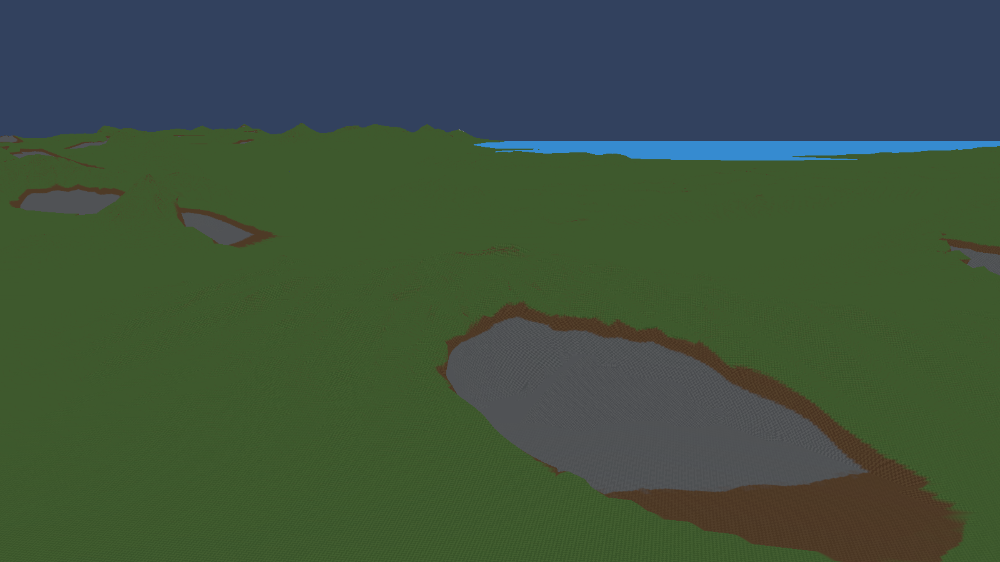
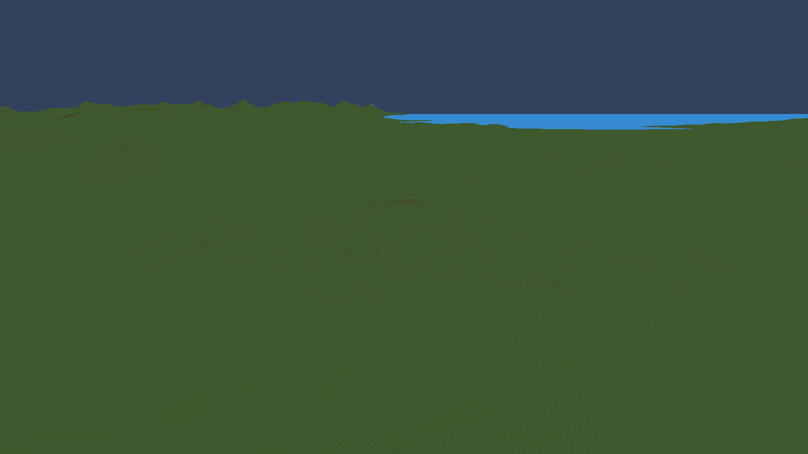
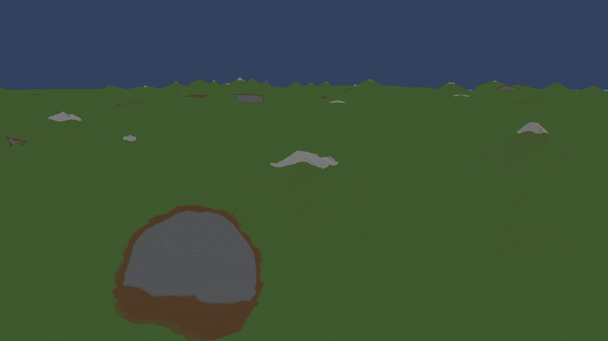
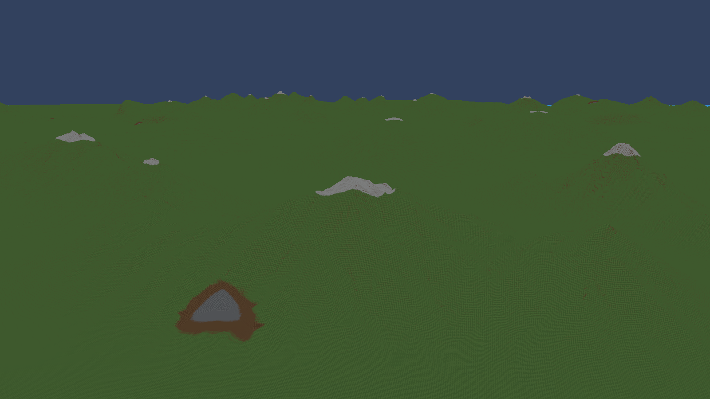

# Smaller, rarer cliff cuts — candidate M

The cut candidates now occupy 51 of 256 hash values instead of 128: about 60% fewer eligible locations. The major and minor radii are 45% of their previous size, vertical extent is 65%, and the undercut is 64 instead of 128 world units. These are generator parameters; visible cliff frequency also depends on whether each cut meets the mountainside.

MountainAmount remains 0.3. Mountain layouts, erosion and snow are unchanged. Generator26 separates the changed density field from older saves. CPU and GPU use matching parameters and conservative bounds.

## Broad mountain: same camera

Before:

After:

## Snowy ridge: same camera

Before:

After:

The oval outline itself is unchanged. This iteration addresses the size and frequency of cuts. Optional water in enclosed basins was discussed but is not implemented by this change.

Visual inspection confirms that the huge opening at site 2 is gone and the opening at site 7 is much smaller. The mountain silhouettes remain intact.

The fixed benchmark completed at 490 FPS versus 625 before, with worse percentile frame times. GPU timing was exactly constant throughout both windows, an unresolved telemetry concern. This result is retained as a failed performance comparison; the change remains an uncommitted prototype.
