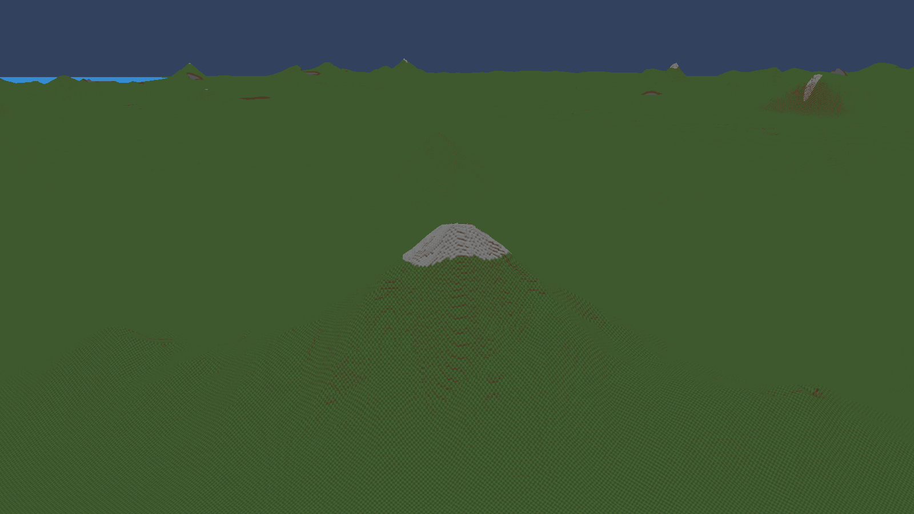
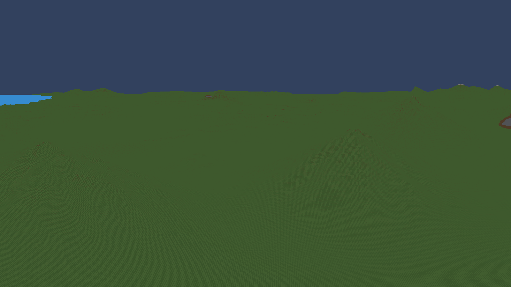
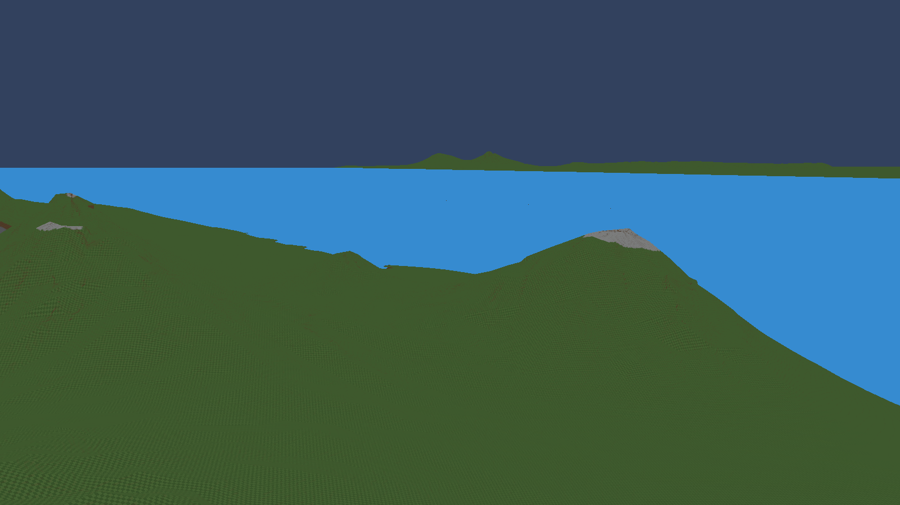
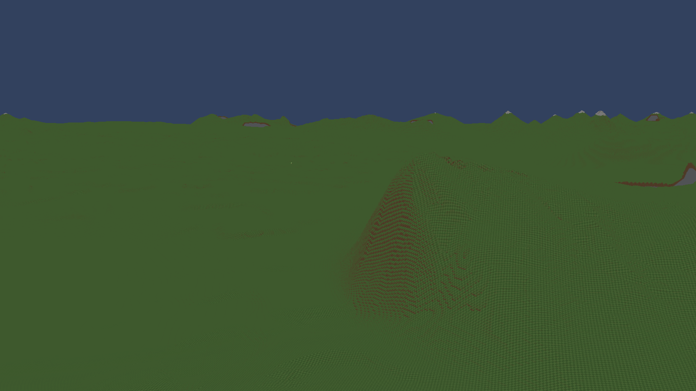

# Mountain diversity gallery — candidate L

Six selected mountain views from twelve inspected sites in one uninterrupted playable world run. These meet my prototype visual target: their summit arrangements, slopes and cliff context are visibly different. This is a selected sample, not a guarantee that every generated mountain is unique.

Seed **1337**, MountainAmount **0.3**, generator **25**, world **3516e7a8-d89a-4813-8628-8541b6fe6f8a**. The source and recipe stayed unchanged between captures. Each image has a matching `diversity-L-site-N.json`, `-column.json`, and `-camera.json` with the location and native camera evidence.

## 1. Snow-capped pinnacle — site 1

One dominant summit rises above unequal low shoulders. Its compact cap and strongly sloping flanks give it a different silhouette from the broad and twin forms below.

## 2. Broad cliff amphitheatre — site 2

A low, broad mountain exposes a large rock face below a gentle grassy top. It offers a different traversal shape from the pointed peaks. The oval cut still looks too regular; this is an interesting prototype feature with room for refinement.

## 3. Bare twin saddle — site 4

Two unequal bare summits share a wide, low saddle and gradual lower slopes. The low connecting terrain and widely separated high points distinguish this group from the single pinnacle.

## 4. Coastal stepped summits — site 5

A broad upper summit and smaller neighboring peaks step down toward the coast. The long backslope and sea-facing saddle make the overall formation interesting beyond the presence of snow.

## 5. Snowy ridge above a rock bowl — site 7

A segmented snowy crest sits behind an exposed cliff, with a connected grassy shoulder and a separate taller neighbor. It combines a ridge silhouette with abrupt rock relief.

## 6. Bare asymmetric rib — site 8

An off-center crest has a steep, soil-striped front and a much longer gentle shoulder. The view records the surrounding area: the candidate XY and sampled height in its metadata are not the exact visible summit location or elevation.

## Selection and limits

Sites 0, 3, 9, 10 and 11 were excluded as too similar or weakly distinctive in the inspected views. Site 6 was poorly framed. Earlier framings of 4, 5 and 8 are retained separately and are not counted again.

The six selections include three snowy and three bare formations, pointed/twin/elongated layouts, gentle slopes and exposed cliffs. Local erosion strength now varies deterministically between groups, but these screenshots do not isolate erosion strength from slope or viewing distance. Detached-camera views use the running world's existing streaming origin; distant terrain can retain coarser detail. Some cliff footprints are visibly oval, and some peaks elsewhere remain repetitive.

Native compilation passes with zero errors or warnings. The fixed figure-eight measured **625.37 FPS versus 643.11 FPS before (-2.76%)**, with moving p95/p99 **2.6595/3.3551 ms** versus **2.5687/3.2383 ms**. The worst moving frame increased from **83.47 to 99.62 ms**, exceeding the recorded 10% flag. Full performance acceptance remains unresolved; this is an uncommitted prototype. See the validation ledger and raw `diversity-L-result.json` for the complete comparison.

The final fixed surveys checked 20,866 production samples with zero repeatability, non-finite or height-bound failures. All six capture records share the same world ID, and native camera readbacks match their requested poses within serialization precision. Transition density audit coverage remains incomplete despite zero reported failures in the inspected records.
