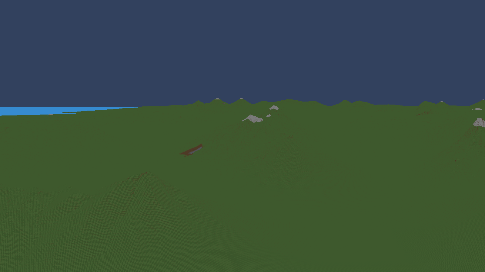
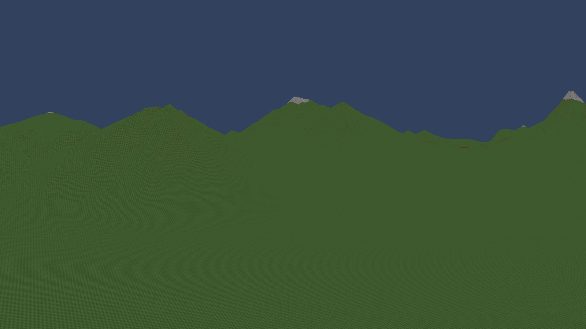
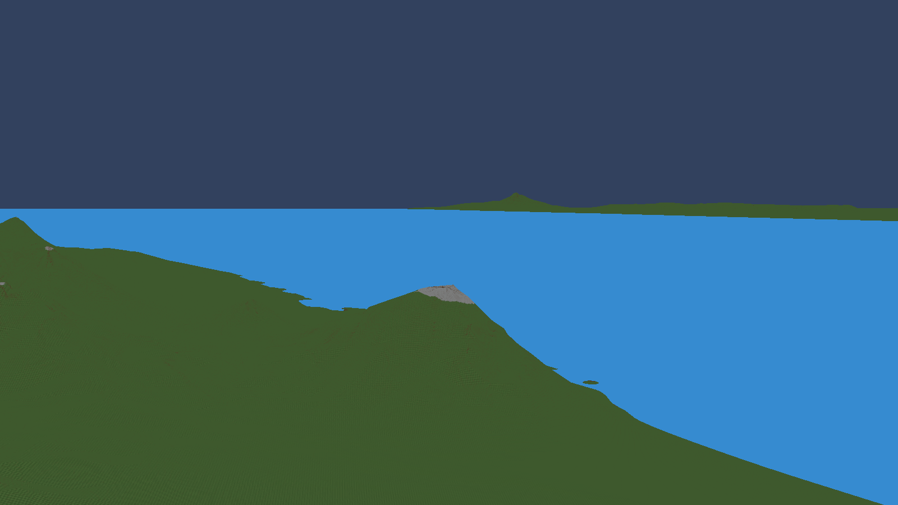
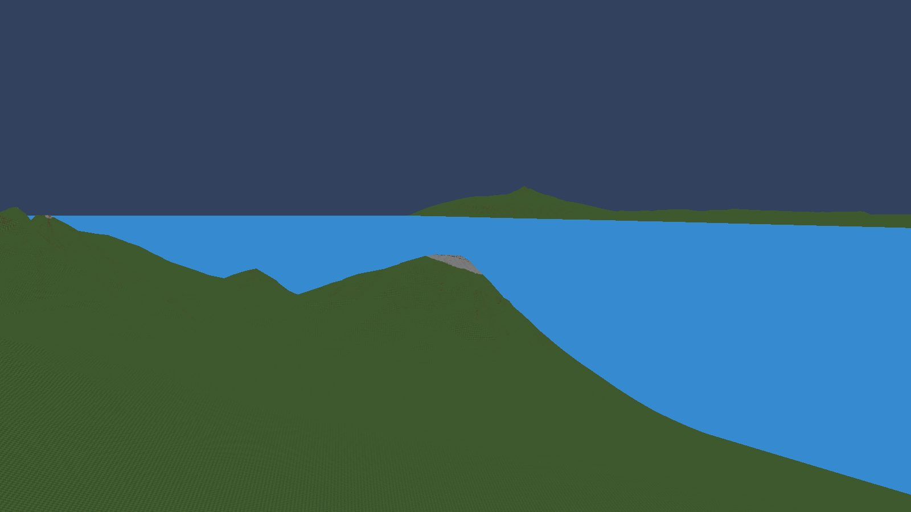
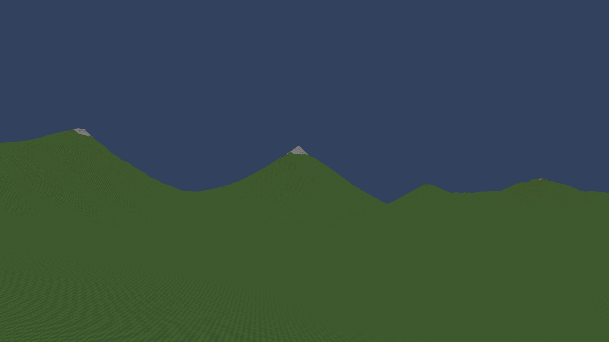
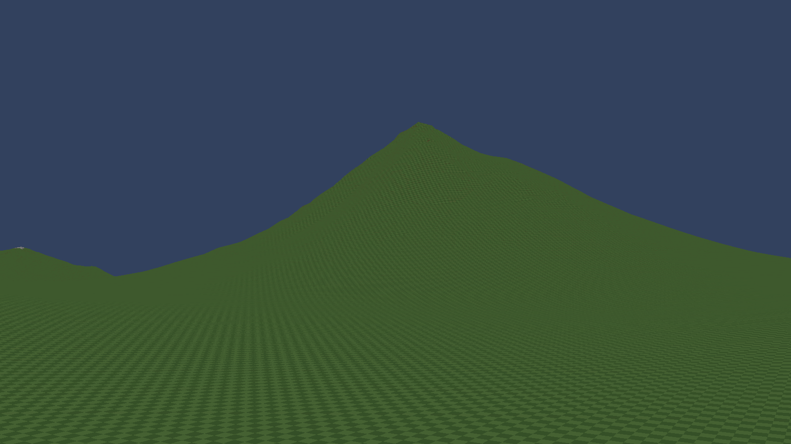

# Regional upland prototype

Mountain amount remains **0.3**. This prototype changes the supporting elevations beneath and between peaks. It preserves the existing summit shapes, erosion, snow, and smaller, rarer cliff cuts.

## Inland range — identical camera

Before, the peaks rise from comparatively low surrounding ground:

After, neighboring peaks stand on a raised, continuous landscape with higher shoulders and saddles:

Both captures use position (10000,-10000,3500), angles (4,-72,0), FOV60. Seed1337 and all recipe settings are unchanged. The before generator is26; after is27.

## Coastal formation — identical camera

Before:

After:

Position (-20000,30000,3600), angles (5,127,0), FOV60. The supporting slopes rise while the formation still descends to the sea. The change here is smaller than in the inland range.

## From near the elevated ground

The camera is at (24000,-36000,2893), about200 units above the sampled surface2693.28, looking toward the inland peaks. High ground connects their bases, with saddles between them.

At (10000,-18000,2600), about200 units above the sampled surface2400.26, the broad supporting slope is visible. This view also exposes the remaining cone-like summit shape; the prototype does not solve that by itself.

## Measured change and limits

Across the same988 strongly mountainous survey positions, median ground height rose from676.81 to2029.68 units. There are713 positions with original height below1000 that rose by at least300. Every surveyed position with land weight<=.65 retained its exact height.

The higher bases improve the range structure in these views. Individual peaks remain too cone-like, and this change creates no new projecting ledges or walk-under overhangs. Distant detached-camera views use the player's existing streaming origin and can show coarse detail. Snow still follows the existing local summit profile, not a newly simulated regional snowline.

The first upland benchmark measured548.55FPS versus595.41 before, with worse tail frame times. Its failure is preserved in the validation ledger. A subsequent optimization skips detail calculations whose terrain weights are zero; its measurements and shape-equivalence checks are recorded separately as N2.

The optimization run (N2) was worse and has been discarded. The retained CPU and GPU upland files exactly match the first measured version (N). Its before/after result is **595.41 → 548.55 FPS (-7.9%)**; moving p95/p99 changed from **2.7269/3.5605 ms** to **3.4993/4.3463 ms**. This remains an uncommitted prototype with unresolved performance acceptance.

All20,866 fixed survey samples passed finite-value, repeatability and height-bound checks. N2 also matched every sampled N height exactly; its rejection was performance-related. Sampled uplifts in strong mountain regions range from169.75 to2026.87 units. The screenshots establish improved supporting relief, not a finished solution to repetitive peaks or missing overhangs.

A concurrent river task added source during the N2 run, outside the fixed78-file manifest. That run is not an isolated comparison, so its slowdown cannot be attributed solely to the optimization. The retained N measurement predates those additions. Final combined-project restart verification was interrupted by the river task's compilation/restart; this gallery records the earlier successful in-world inspections.
