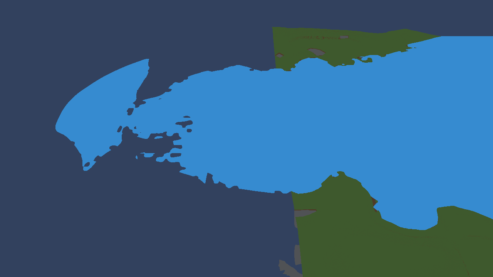

# Water visual-range observation

Read-only inspection of the running basic_example world on engine26.09.08.
No terrain, camera, configuration or runtime source was changed.

The detached game-camera capture shows blue water continuing past the straight
outer edge of the rendered solid terrain. The ordinary player camera did not
show this boundary; this image comes from ejected_camera_screenshot at1280x720.
The detached transform read immediately before capture was
position(-269342.938,69160.0938,47589.8047),angles(41.090435,89.2311554,0),FOV60.

Live configuration: seed1337, generator13, LandAmount0.75, SeaLevel0,
32cells/16units, maximumLOD6, cache half extent8, visual radius512;
slot water-load-comparison-v2. Regular mesh/preparation queues reported0 pending.

SurfaceWaterRenderer.Update builds a separate flat quad with half extent
(halfExtent+1)*anchorSize. VoxelManager supplies the maximum-LOD chunk width
and cache half extent, so the quad's half extent is9*32768=294912 units.
Terrain PrepareLodPlacement defines the maximum-level outer bounds using
anchor +/- cache half extent, or8*32768=262144 units around its anchor.
Water therefore has one extra maximum-LOD chunk of padding on each side when
the anchors coincide. Water also follows the current target independently of
the terrain's committed placement, allowing another mismatch during streaming.

Correction indicated by source inspection: derive the water quad from the
terrain's committed visual bounds at sea level, including its placement readiness
and vertical coverage. Removing padding alone would not address publication
timing or vertical coverage. No correction or performance validation was performed
as part of this screenshot/diagnosis request.
