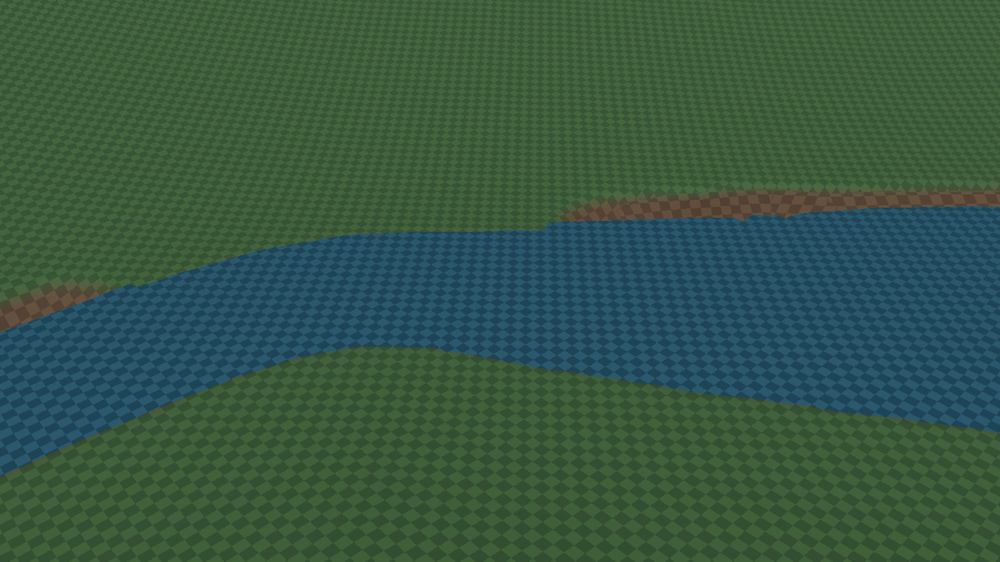
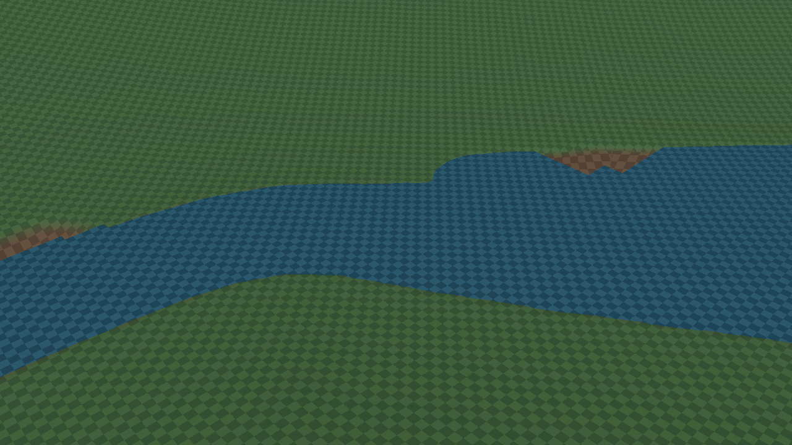
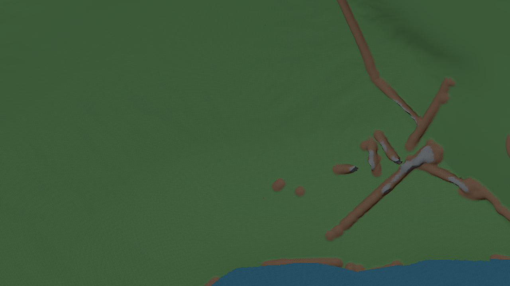
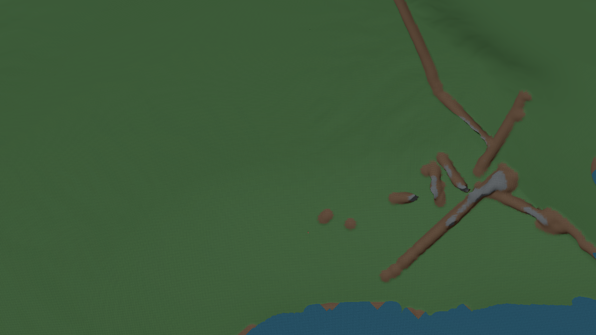

# Water quad and submerged-bound prototype

WATER-FAST-001/v1, 2026-09-15. **Rejected; prior hull restored.**

The fixed scenario and full acceptance decision are recorded in the
[validation ledger](../../ValidationResults.md#water-fast-001v1--quads-and-uniform-submerged-chunks-2026-09-15).
Both runs used saved revision1545/checkpoint26, seed1337, generator48/River14,
1848×960, speed2500, distance50000, one figure-eight loop, the same source outside
the three water files, and the same warmup and spawn.

| Measurement | Hull control | Quad + bound |
| --- | ---: | ---: |
| Settled submitted water vertices | 8187 | 3054 |
| Startup generation + meshing, ms | 2817.9 | 2830.8 |
| Average route FPS | 456.55234 | 500.49252 |
| p95 / p99 frame, ms | 4.1594 / 9.0193 | 3.739 / 8.8665 |
| Maximum frame, ms | 91.1241 | 193.0149 |
| Allocated bytes | 5314903080 | 5488268928 |
| Process peak bytes | 5758697472 | 5645242368 |
| GPU peak bytes | 1967066232 | 1916718200 |
| Near / full arrival, seconds | 1.728009 / 10.746932 | 1.2081236 / 10.2344645 |

Vertices fell62.7% and average FPS rose9.6% in this pair. However, the candidate
exposed water around edited bank cuts, failed the maximum-frame gate, and showed
no water generation speedup. The cause of the single worst-frame spike is not
established. Both runs exceed the existing absolute10-second drain target.
Eleven sampled owners did not demonstrate use of the uniform-submerged shortcut.
Both completed geometry/coverage audits without detected failures.

## Visual evidence

Near view: position(-1800,-1700,800),angles(35,47,0),FOV60,1280×720.

Wide view: position(-1800,-1700,8000),angles(65,47,0),same FOV and dimensions.

## Files and scope

- `control.json` and `candidate.json`: complete route results.
- `*-arrival.json`: arrival and streaming results.
- `*-start.json`, `*-end.json`: actual playable-world snapshots and water counters.
- `*-audits.json`: standard geometry and detailed coverage results.
- `*-source.patch`: working runtime snapshots relative to f0f1e63, including
  unchanged River14 and another task's flicker changes for reproducibility.
  These are evidence, not patches approved for application.
- `control-source-hashes.json`: frozen source hashes used to verify the pair.

The rejected source was removed. The three water files exactly match the tested
hull control, compile successfully, and visible Play was restarted. The earlier
hull prototype remains uncommitted and is not qualified against the original
precise mesher by this experiment.
